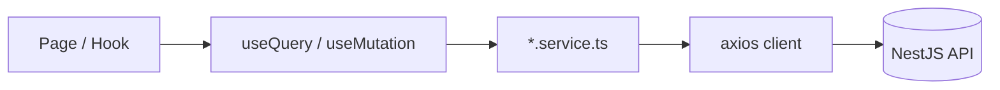

# API Service Layer

The frontend communicates with a remote **NestJS REST API** through a thin service layer. HTTP clients live in `src/lib/`; domain-specific API calls live in `src/features/<module>/services/` or legacy stubs in feature folders.

---

## Architecture



**Rule:** Components and pages call **hooks**, not axios directly. Hooks call **services**. Services call **HTTP clients**.

---

## HTTP clients

### Main tenant API — `axiosInstance`

**File:** `src/lib/axios.ts`

| Setting | Value |
|---------|-------|
| `baseURL` | `import.meta.env.VITE_API_URL` |
| `withCredentials` | `true` (httpOnly refresh cookie) |
| `timeout` | 15 seconds |
| Auth header | `Authorization: Bearer <authStore.accessToken>` |

**Interceptors:**

1. **Request** — attaches access token from `useAuthStore.getState().accessToken`
2. **Response** — on 401, silent refresh via `POST /api/auth/refresh`, retry with queue
3. **Dev mock** — when `VITE_MOCK_API=true`, returns fixtures on network failure

Used by: main ERP modules, auth, audit logs, sessions, dashboard widgets, homepage config.

### Super-admin API — `superAdminApiClient`

**File:** `src/lib/superAdminApiClient.ts`

| Setting | Value |
|---------|-------|
| `baseURL` | `import.meta.env.VITE_API_BASE_URL` (fallback `/api`) |
| Auth header | `Authorization: Bearer <superAdminAuthStore.accessToken>` |

**Interceptors:**

- 401 on authenticated session → `logout()` + redirect `/superadmin/login`
- Errors wrapped in `ApiError` class

Used by: Tenant module, super-admin auth.

### Env var summary

| Variable | Client | Documented in `.env.example` |
|----------|--------|------------------------------|
| `VITE_API_URL` | `axiosInstance` | Yes |
| `VITE_API_BASE_URL` | `superAdminApiClient` | No |

---

## Service file pattern

Reference: `src/features/tenants/services/tenant.service.ts`

```typescript
import { axiosInstance } from '@/lib/axios';
// or: import { superAdminApiClient, type ApiEnvelope } from '@/lib/superAdminApiClient';

export const <entity>Service = {
  async list(params) {
    const { data } = await axiosInstance.get('/api/<entities>', { params });
    return data;
  },
  async getById(id: string) {
    const { data } = await axiosInstance.get(`/api/<entities>/${id}`);
    return data;
  },
  async create(dto) {
    const { data } = await axiosInstance.post('/api/<entities>', dto);
    return data;
  },
  async update(id, dto) {
    const { data } = await axiosInstance.patch(`/api/<entities>/${id}`, dto);
    return data;
  },
  async delete(id) {
    await axiosInstance.delete(`/api/<entities>/${id}`);
  },
};
```

**Conventions:**

- Export a single object (`tenantService`, `employeeService`)
- Methods are `async`, return typed promises
- No React imports
- Unwrap `ApiEnvelope` in service: `res.data.data`
- Path prefix `/api/...` on main client (align with `VITE_API_URL` configuration)

---

## Response shapes

### Direct JSON (main API)

Many endpoints return the resource directly:

```typescript
const { data } = await axiosInstance.get<AuthUser>('/api/auth/me');
```

### Envelope (super-admin API)

```typescript
interface ApiEnvelope<T> {
  data: T;
  message?: string;
  success?: boolean;
  meta?: PaginationMeta;  // list endpoints
}
```

### NestJS errors

```typescript
interface BackendError {
  message: string | string[];
  error?: string;
  statusCode: number;
}
```

Mapped to user strings in `authStore.extractErrorMessage()`.

---

## Hook integration (TanStack Query)

**Query keys** — namespace per module:

```typescript
export const tenantKeys = {
  all: ['superadmin', 'tenants'] as const,
  list: (params) => [...tenantKeys.all, 'list', params] as const,
  detail: (id) => [...tenantKeys.all, 'detail', id] as const,
};
```

**List query:**

```typescript
export function useTenants(params) {
  return useQuery({
    queryKey: tenantKeys.list(params),
    queryFn: () => tenantService.list(params),
    placeholderData: keepPreviousData,
    staleTime: 30_000,
  });
}
```

**Mutations** invalidate related keys on success.

**Global defaults** (`src/lib/queryClient.ts`):

- `staleTime`: 5 minutes
- `retry`: 1
- `refetchOnWindowFocus`: false

---

## Legacy patterns (still in codebase)

### Stub services

```typescript
// features/hr/services/employeeService.ts
export const employeeService = {
  getEmployees: async () => {
    // await fetch('/api/employees') ...
    return [];
  },
};
```

Pages fetch via `useEffect` + `useState` instead of TanStack Query.

### Direct axios in hooks

Shared hooks call `axiosInstance` directly:

- `useAuditLogs` → `GET /api/audit-logs`
- `useSessions` → `GET /api/auth/sessions`
- `useHomepageConfig` → `GET/PATCH /api/users/:id/homepage-config`
- Dashboard widgets → various `/api/jobs/summary/*` endpoints

### Widget pattern

```typescript
useEffect(() => {
  axiosInstance.get('/api/jobs/summary/open')
    .then(({ data }) => setSummary(data))
    .catch(() => setError(true));
}, []);
```

Migrate new work to service + Query hooks.

---

## API surface reference

| Domain | Base path | Client |
|--------|-----------|--------|
| Auth | `/api/auth/*` | `axiosInstance` |
| Users | `/api/users/*` | `axiosInstance` |
| Audit | `/api/audit-logs` | `axiosInstance` |
| Jobs summary | `/api/jobs/summary/*` | `axiosInstance` |
| Tenants | `/tenants/*` | `superAdminApiClient` |
| Super-admin auth | `/auth/superadmin/login` | `superAdminApiClient` |

Full endpoint inventory: [backend-architecture.md](./backend-architecture.md).

---

## Related docs

- [State management](./state-management.md) — Query cache
- [Authentication](./authentication.md) — token interceptors
- [Module template](./module-template.md) — service boilerplate
