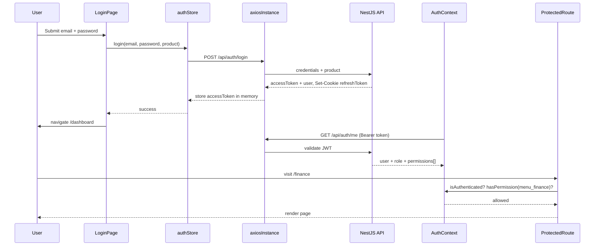

# Authentication Flow

This document describes how users sign in, how tokens are managed, how routes are protected, and how role-based access control (RBAC) works in the frontend.

## End-to-end flow



---

## 1. Login

**Page:** `src/features/auth/pages/LoginPage.tsx`

- Form validated with **Zod** + **React Hook Form**
- Calls `useAuthStore().login(email, password, product)`
- Product is fixed to `KingFisher Tech Gold` for this application
- On success, navigates to `/dashboard`
- On failure, displays `authStore.error` (mapped from NestJS response)

**API:** `POST /api/auth/login`

```json
{
  "email": "user@example.com",
  "password": "***",
  "product": "KingFisher Tech Gold"
}
```

**Response:**

```json
{
  "user": { "id", "name", "email", "role", "product" },
  "accessToken": "<jwt>"
}
```

The refresh token is set as an **httpOnly cookie** by the server — the frontend never reads or stores it in JavaScript.

### Login error handling

`authStore.extractErrorMessage()` translates backend 401/403/429 responses into user-friendly copy:

- Invalid credentials
- Account locked
- Outside office hours
- IP / MAC restriction denied
- Wrong product entitlement (403)
- Network unreachable

---

## 2. Session restore (returning visitor)

**Components:** `AuthProvider`, `AuthLoadingGate`

On app load:

1. `authStore` rehydrates from sessionStorage (`user`, `isAuthenticated` — **not** `accessToken`).
2. If `accessToken` is still in memory (same tab, no full reload), `AuthContext` fetches `/api/auth/me`.
3. `AuthLoadingGate` shows a spinner when a token exists but `/api/auth/me` has not completed — avoids flashing the login page.

After a **full page reload**, `accessToken` is lost from memory. The axios 401 interceptor triggers `POST /api/auth/refresh` using the httpOnly cookie to obtain a new access token before retrying failed requests.

---

## 3. Token refresh

**File:** `src/lib/axios.ts`

When any API call returns **401** (except `/auth/login`, `/auth/refresh`, `/auth/logout`):

1. If a refresh is already in progress, queue the request.
2. Otherwise call `authStore.refreshAccessToken()` → `POST /api/auth/refresh` with `withCredentials: true`.
3. On success, update `accessToken` and retry the original request.
4. On failure, call `logout()` and redirect to `/login`.

This implements a **silent refresh** pattern with request deduplication.

---

## 4. Logout

**Triggers:** `LogoutButton`, failed refresh, explicit `authStore.logout()`

1. `POST /api/auth/logout` (best effort)
2. Clear `accessToken`, `user`, `isAuthenticated` in store
3. Hard redirect: `window.location.href = '/login'`
4. `AuthContext` clears `user` on next render cycle

---

## 5. Password recovery

| Page | Route | API |
|------|-------|-----|
| Forgot password | `/forgot-password` | `POST /api/auth/forgot-password` `{ email }` |
| Reset password | `/reset-password` | `POST /api/auth/reset-password` (token + new password) |

These routes are **public** (no `ProtectedRoute` wrapper).

---

## 6. Route protection

**Component:** `src/components/routing/ProtectedRoute.tsx`

Checks (in order):

1. `isLoading` → render `AppShellSkeleton`
2. `!isAuthenticated` → `<Navigate to="/login" state={{ from: location }} />`
3. Permission / role denial → `<Navigate to="/403" />`
4. Otherwise → `<Outlet />`

### Props

| Prop | Effect |
|------|--------|
| `requirePermissions` | User must have **all** listed keys |
| `requireAnyPermission` | User must have **at least one** key |
| `requireRole` | User's `role.slug` must match (e.g. `"admin"`) |
| `redirectTo` | Custom login redirect (default `/login`) |

### Nested guards in router

```tsx
// Finance module
<ProtectedRoute requirePermissions={['menu_finance']}>
  { /* /finance, /invoices */ }
</ProtectedRoute>

// Admin masters
<ProtectedRoute requireRole="admin">
  { /* /masters, /masters/airlines */ }
</ProtectedRoute>
```

---

## 7. RBAC in the UI

### Permission keys

Canonical list in `src/types/auth.types.ts`. Sidebar (`Sidebar.tsx`) maps each nav item to a permission:

```typescript
{ label: 'Finance', path: '/finance', permission: 'menu_finance' }
```

Items are hidden unless `authCtx.hasPermission(permission)` returns true.

### Role display

`RoleBadge` component maps role slugs to colors. Extend when backend adds roles.

### Financial visibility

Dashboard widgets respect `financialVisibility` from homepage config (`canSeeRevenue`, `canSeeGP`, etc.) — separate from menu permissions.

---

## 8. Session management (admin)

**Page:** `src/pages/settings/SessionManagementPage.tsx`  
**Hook:** `useSessions`

| Action | API |
|--------|-----|
| List sessions | `GET /api/auth/sessions` |
| Revoke session | `DELETE /api/auth/sessions/:id` |

Backend marks `isCurrent` on the active session so users cannot accidentally revoke their own session without re-login (behavior depends on backend).

---

## 9. Login security (per-user restrictions)

**Page:** `src/pages/settings/LoginSecurityPage.tsx`  
**Hook:** `useLoginSecurity`

Administrators configure per-user:

- IP range allowlists
- MAC address allowlists
- Office hours + timezone
- Multi-login allowed flag

Enforced at **login time** on the backend; frontend only configures and displays settings.

---

## 10. Super-admin authentication (separate flow)

**Not active** in the current router (routes commented out).

| Item | Detail |
|------|--------|
| Login page | `SuperAdminLoginPage` |
| Store | `superAdminAuthStore` |
| Service | `superAdminAuthService.login()` → `POST /auth/superadmin/login` |
| Client | `superAdminApiClient` (separate axios instance) |
| Guard | `SuperAdminProtectedRoute` |

Super-admin tokens do **not** share the tenant `authStore` or `AuthContext`.

---

## 11. Development bypass flags

| Env var | Effect |
|---------|--------|
| `VITE_BYPASS_AUTH=true` | Skip `/api/auth/me`; inject mock admin user; all permissions granted |
| `VITE_MOCK_API=true` | When backend is unreachable, return fixture data for select endpoints |

Both are **dev-only** (`import.meta.env.DEV` guards in code). Never enable in production builds.

---

## 12. Security considerations (frontend)

| Practice | Implementation |
|----------|----------------|
| Refresh token not in JS | httpOnly cookie |
| Access token not in localStorage | Zustand memory + sessionStorage excludes token |
| Credentials on refresh | `withCredentials: true` |
| Logout clears state | Store reset + hard redirect |
| CSRF | Depends on backend cookie policy (document in backend repo) |

---

## 13. Auth-related files reference

| File | Role |
|------|------|
| `src/store/authStore.ts` | Login, logout, refresh, token storage |
| `src/context/AuthContext.tsx` | User profile + permission helpers |
| `src/hooks/useAuth.ts` | Context consumer |
| `src/lib/axios.ts` | Interceptors, mock API |
| `src/components/routing/ProtectedRoute.tsx` | Route guard |
| `src/components/skeletons/AuthLoadingGate.tsx` | Initial session gate |
| `src/types/auth.types.ts` | Permission keys, JWT shape |
| `src/features/auth/pages/*` | Login, forgot/reset password |
