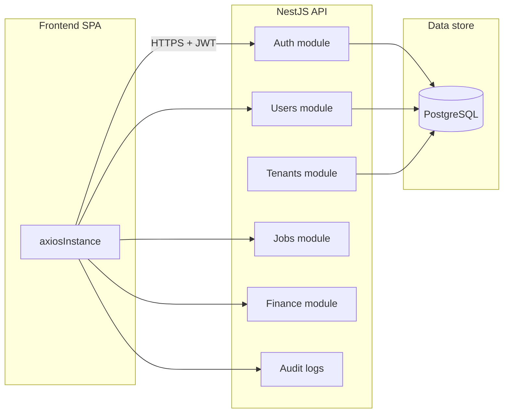

# Backend Architecture

## Scope of this document

**This repository contains only the frontend.** The backend is a separate **NestJS** application with **PostgreSQL**, maintained by the backend team (see root [README](../README.md)).

This document describes the **inferred backend architecture** from API contracts, TypeScript types, and comments in the frontend codebase. For authoritative API specs, refer to the backend repository and its Swagger/OpenAPI docs.

## High-level backend model



## Deployment

The frontend `.env.example` points to a hosted API:

```
VITE_API_URL=https://kingfisherwings.onrender.com
```

Local development typically uses `http://localhost:3000` (with or without `/api` prefix — ensure `VITE_API_URL` matches how the backend mounts routes).

## Authentication API

| Method | Endpoint | Purpose |
|--------|----------|---------|
| `POST` | `/api/auth/login` | Email + password + product → `{ user, accessToken }` |
| `POST` | `/api/auth/logout` | Invalidate session |
| `POST` | `/api/auth/refresh` | Exchange httpOnly refresh cookie → new `accessToken` |
| `GET` | `/api/auth/me` | Current user profile with role and permissions |
| `POST` | `/api/auth/forgot-password` | Trigger password reset email |
| `POST` | `/api/auth/reset-password` | Complete password reset |
| `GET` | `/api/auth/sessions` | List active sessions for current user |
| `DELETE` | `/api/auth/sessions/:id` | Revoke a session |

### Token model

- **Access token**: short-lived JWT returned in login response; sent as `Authorization: Bearer` header.
- **Refresh token**: stored in an **httpOnly cookie** by NestJS (`withCredentials: true` on axios).
- Access token is **not** persisted to `localStorage`/`sessionStorage` (security by design in `authStore`).

### JWT payload shape

Defined in `src/types/auth.types.ts` as `JWTPayload`:

- `sub`, `email`, `name`, `tenantId`
- `roleId`, `roleName`, `roleSlug`
- `permissions[]` — menu/feature keys
- `product` — multi-product suite identifier
- `iat`, `exp`

### Login security (per-user)

| Method | Endpoint | Purpose |
|--------|----------|---------|
| `GET` | `/api/users/:id/login-security` | IP/MAC/office-hours restrictions |
| `PATCH` | `/api/users/:id/login-security` | Update restrictions |

The backend enforces these at login time; the frontend maps 401 messages (locked account, outside office hours, IP/MAC denied) in `authStore.extractErrorMessage`.

## Authorization (RBAC)

Permission keys are **string enums** shared between backend JWT and frontend (`PermissionKey` in `auth.types.ts`):

- `menu_dashboard`, `menu_customers`, `menu_quotations`
- `menu_jobs_air_export`, `menu_jobs_sea_export`, `menu_jobs_sea_import`
- `menu_documentation`, `menu_finance`, `menu_nvocc`, `menu_hr`
- `menu_masters`, `menu_reports`, `menu_settings`

The sidebar also references `menu_management` and `menu_sales`, which are **not** in the canonical `PermissionKey` union — likely backend additions pending type sync.

Role slugs (e.g. `admin`) gate admin-only routes via `ProtectedRoute requireRole="admin"`.

## Multi-tenancy

`AuthUser` includes `tenantId`. Business data is scoped per tenant on the backend. The **super-admin** surface manages tenants across the platform (separate auth flow — see below).

## Domain API surfaces (inferred)

Endpoints referenced by the frontend:

### Users & homepage

| Method | Endpoint | Purpose |
|--------|----------|---------|
| `GET` | `/api/users?limit=200` | User picker (login security admin) |
| `GET/PATCH` | `/api/users/:id/homepage-config` | Dashboard widget layout |

### Jobs & operations

| Method | Endpoint | Purpose |
|--------|----------|---------|
| `GET` | `/api/jobs/recent?limit=5` | Recent jobs widget |
| `GET` | `/api/jobs/summary/open` | Open jobs count |
| `GET` | `/api/jobs/summary/by-mode` | Shipments by mode chart |
| `GET` | `/api/jobs/summary/upcoming-etds` | Upcoming ETD list |
| `GET` | `/api/tasks/pending` | Pending tasks widget |

### Quotations & finance

| Method | Endpoint | Purpose |
|--------|----------|---------|
| `GET` | `/api/quotations/summary/pending` | Pending quotations widget |
| `GET` | `/api/finance/summary/revenue-mtd` | Revenue month-to-date |

### Audit

| Method | Endpoint | Purpose |
|--------|----------|---------|
| `GET` | `/api/audit-logs?...` | Paginated audit log (query params for filters) |

Many module services (`employeeService`, `clientService`, `userService`) are still **placeholders** — backend endpoints for those domains are not yet wired in the frontend.

## Super-admin API (separate client)

Super-admin uses `superAdminApiClient` (`src/lib/superAdminApiClient.ts`) with a different configuration:

| Method | Endpoint | Purpose |
|--------|----------|---------|
| `POST` | `/auth/superadmin/login` | Super-admin login |
| `GET` | `/tenants` | List tenants (paginated) |
| `GET` | `/tenants/:id` | Tenant detail |
| `GET` | `/tenants/statistics` | Platform stats |
| `POST` | `/tenants` | Create tenant |
| `PATCH` | `/tenants/:id` | Update tenant |
| `DELETE` | `/tenants/:id` | Soft delete |
| `PATCH` | `/tenants/:id/restore` | Restore tenant |
| `PATCH` | `/tenants/:id/activate` | Activate tenant |
| `PATCH` | `/tenants/:id/deactivate` | Deactivate tenant |

Responses use an **envelope** pattern:

```typescript
interface ApiEnvelope<T> {
  data: T;
  message?: string;
  success?: boolean;
  meta?: PaginationMeta; // on list endpoints
}
```

## Error response format

NestJS standard errors are handled in `authStore`:

```typescript
interface BackendError {
  message: string | string[];
  error?: string;
  statusCode: number;
}
```

The frontend maps HTTP status codes (401, 403, 429, 503) to user-facing strings.

## Products

The login flow requires a `product` field. Supported values:

- `KingFisher Tech Gold` (this app)
- `KingFisher Tech Global`
- `KingFisher Tech App`
- `KingFisher Tech Analytics`

The backend validates that the user is entitled to the requested product (403 if not).

## What is not documented here

Because the backend source is external to this repo, the following require documentation in the **backend project**:

- Database schema and migrations
- Module boundaries inside NestJS
- Webhook/EDI integrations (Bayan EDI, agent EDI)
- Background jobs and file storage
- Deployment and environment variables for the API server
- Full OpenAPI/Swagger export

See [Missing Documentation](./missing-documentation.md) for recommended next steps.
