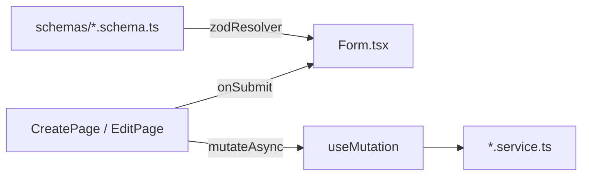

# Form Handling

How forms are built, validated, and submitted across the KingFisher Tech Gold frontend.

---

## Standard stack

| Layer | Library |
|-------|---------|
| Form state | [react-hook-form](https://react-hook-form.com/) |
| Schema validation | [Zod](https://zod.dev/) |
| Resolver bridge | `@hookform/resolvers/zod` → `zodResolver(schema)` |

Used on: login pages, tenant CRUD, super-admin login, login security settings.

---

## Architecture



---

## Validation structure

### Schema file (`schemas/<entity>.schema.ts`)

```typescript
import { z } from 'zod';

export const createEntitySchema = z.object({
  name: z.string().min(1, 'Required'),
  code: z.string().regex(/^[A-Z0-9-]{3,20}$/, 'Invalid code format'),
  email: z.string().email('Must be a valid email'),
  notes: z.string().optional().or(z.literal('')),
  amount: z.number().int().min(0),
  status: z.enum(['active', 'inactive']),
});

export type CreateEntityFormValues = z.infer<typeof createEntitySchema>;

export const updateEntitySchema = createEntitySchema.omit({
  code: true,  // immutable after create
});

export type UpdateEntityFormValues = z.infer<typeof updateEntitySchema>;
```

### Type re-exports (`types/<entity>.types.ts`)

```typescript
export type { CreateEntityFormValues, UpdateEntityFormValues } from '../schemas/<entity>.schema';
```

### Common Zod patterns in this codebase

| Field type | Pattern |
|------------|---------|
| Required text | `z.string().min(1, 'Required')` |
| Optional empty string | `.optional().or(z.literal(''))` |
| Email | `z.string().email(...)` |
| URL | `z.string().url(...).optional().or(z.literal(''))` |
| Hex color | `z.string().regex(/^#([0-9A-Fa-f]{3}){1,2}$/, ...)` |
| Country code | `z.string().regex(/^[A-Z]{2}$/, ...)` |
| Enum | `z.enum(['starter', 'growth', 'enterprise'])` |
| Numbers in forms | `register('field', { valueAsNumber: true })` |

---

## Form component pattern (Tenant reference)

**File:** `src/features/tenants/components/TenantForm/TenantForm.tsx`

```typescript
interface EntityFormProps {
  mode: 'create' | 'edit';
  defaultValues?: Partial<CreateEntityFormValues>;
  onSubmit: (values: CreateEntityFormValues) => void | Promise<void>;
  isSubmitting?: boolean;
  error?: string | null;
}

export function EntityForm({ mode, defaultValues, onSubmit, isSubmitting, error }: EntityFormProps) {
  const schema = mode === 'create' ? createEntitySchema : updateEntitySchema;
  const { register, handleSubmit, formState: { errors } } = useForm({
    resolver: zodResolver(schema),
    defaultValues,
  });

  return (
    <form onSubmit={handleSubmit(onSubmit)} noValidate>
      {error && <div role="alert" className="...">{error}</div>}
      {/* fields with register() + errors.field?.message */}
      <button type="submit" disabled={isSubmitting}>
        {isSubmitting ? 'Saving…' : mode === 'create' ? 'Create' : 'Save changes'}
      </button>
    </form>
  );
}
```

**Conventions:**

- Single form component for create **and** edit (`mode` prop)
- Create-only fields wrapped in `{mode === 'create' && (...)}`
- Sections grouped with headings (Company identity, Regional settings, …)
- Inline `inputClass` string for consistent Tailwind styling
- Field errors: `text-xs text-rose-600` under each input
- Root API errors: banner above form (`role="alert"`)

---

## Page wiring

### Create page

```typescript
const { createEntity } = useEntityMutations();
const [formError, setFormError] = useState<string | null>(null);

<EntityForm
  mode="create"
  isSubmitting={createEntity.isPending}
  error={formError}
  onSubmit={async (values) => {
    setFormError(null);
    try {
      const created = await createEntity.mutateAsync(values);
      navigate(`/module/entities/${created.id}`);
    } catch (e) {
      setFormError(e instanceof Error ? e.message : 'Failed to create.');
    }
  }}
/>
```

### Edit page

```typescript
const { data, isLoading } = useEntity(id);
const { updateEntity } = useEntityMutations();

if (isLoading || !data) return <div>Loading…</div>;

<EntityForm
  mode="edit"
  defaultValues={data}
  isSubmitting={updateEntity.isPending}
  onSubmit={async (values) => {
    await updateEntity.mutateAsync({ id, dto: values });
    navigate(`/module/entities/${id}`);
  }}
/>
```

---

## Auth forms

### Main login (`LoginPage`)

- Zod schema inline in page file
- `useAuthStore().login(email, password, product)`
- Errors from store `error` string (not react-hook-form root)
- `extractErrorMessage()` maps NestJS 401/403 to user copy

### Super-admin login (`SuperAdminLoginPage`)

- Zod + react-hook-form
- `useMutation` + `superAdminAuthService.login`
- API errors via `setError('root', { message })` + `ApiError`
- Red alert banner for root errors

### Password recovery

- `ForgotPasswordPage` — `POST /api/auth/forgot-password`
- `ResetPasswordPage` — `POST /api/auth/reset-password`
- Public routes, no `AppShell`

---

## Settings forms

### Login security (`LoginSecurityForm`)

- Controlled by `useLoginSecurity(userId)` hook
- PATCH `/api/users/:id/login-security`
- Sub-forms: `OfficeHoursEditor`, `TagInput` for IP/MAC lists
- Separate validators in `loginSecurity/validators.ts`

### Session management

- Not a traditional form — `SessionList` + `RevokeConfirmModal`
- DELETE `/api/auth/sessions/:id`

---

## Legacy forms (no react-hook-form)

Many ERP list pages use **uncontrolled inputs**:

```tsx
<input type="text" placeholder="Search: Name" className="border ..." />
<select defaultValue="All">...</select>
```

Filter grids with label-right alignment (`w-20 text-right` labels) in `EmployeesListPage`, `UserAccessPage`, `AllShipmentsPage`.

**Do not copy for new modules** — use Tenant / module-template pattern instead.

---

## Multi-step forms

`StepFormTemplate` in `src/components/templates/StepFormTemplate.tsx` exists for wizards. Job and quotation create forms (`CreateJobForm.tsx`, `CreateQuotationForm.tsx`) may use custom step logic — not yet standardized.

---

## Error handling summary

| Level | Mechanism |
|-------|-----------|
| Field validation | Zod → `errors.field.message` under input |
| API / mutation | `formError` state or `setError('root')` banner |
| Auth store login | `authStore.error` displayed on login page |
| Loading | `isSubmitting` / `mutation.isPending` disables submit |

---

## Related docs

- [Module template](./module-template.md) — form boilerplate
- [Project patterns](./project-patterns.md) — form conventions
- [API service layer](./api-service-layer.md) — mutation services
- [Authentication](./authentication.md) — login forms
