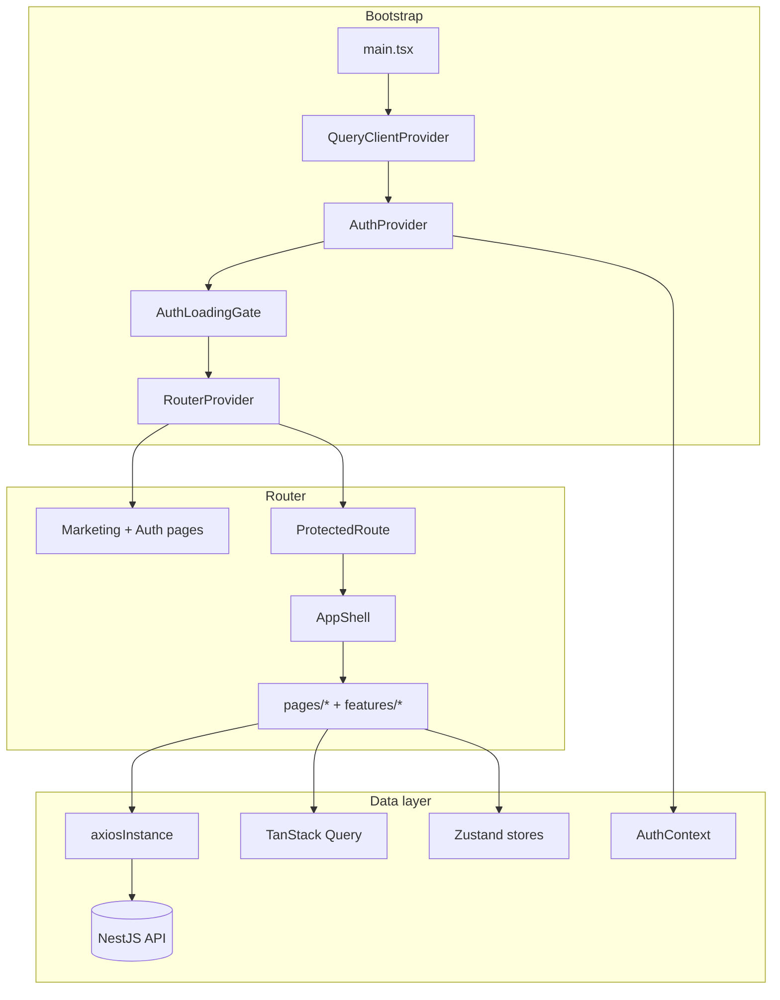

# Frontend Architecture

## Overview

KingFisher Tech Gold is a **single-page application (SPA)** built with React 19, TypeScript, and Vite 8. It targets freight forwarders, NVOCCs, and 3PL providers with a modular ERP UI (customers, jobs, documentation, finance, HR, and more).

The frontend is **API-driven**: all business data comes from a remote NestJS backend via HTTP. There is no server-side rendering; production output is static assets served by any static host (or `vite preview`).

## Technology stack

| Layer | Technology | Notes |
|-------|------------|-------|
| UI framework | React 19 | StrictMode enabled in `main.tsx` |
| Language | TypeScript ~6 | Path alias `@` → `src/` |
| Build | Vite 8 | `@vitejs/plugin-react`, Tailwind v4 via `@tailwindcss/vite` |
| Routing | React Router 7 | `createBrowserRouter` + `RouterProvider` |
| Server state | TanStack Query 5 | Default stale time 5 minutes |
| Client state | Zustand 5 | Persist middleware for UI preferences |
| HTTP | Axios | Shared instance with interceptors |
| Forms | React Hook Form + Zod | Used on login and tenant forms |
| Styling | Tailwind CSS 4 | CSS variables in `styles/brand-tokens.css` |
| Components | Radix Slot, Lucide icons | Lightweight primitives; not full shadcn install |
| Visualization | Recharts, Three.js / R3F | Dashboard widgets and marketing 3D |
| Animation | Framer Motion | Marketing and transitions |
| Component docs | Storybook 10 | `npm run storybook` |
| Testing | Vitest + Playwright | Storybook browser tests configured |

## Application bootstrap

Entry point: `src/main.tsx`

```
QueryClientProvider
  └── AuthProvider          (fetches /api/auth/me when token exists)
        └── AuthLoadingGate (blocks render during session restore)
              └── RouterProvider (router from src/router/index.tsx)
```

`AuthLoadingGate` prevents a flash of the login page when a returning user still has a valid access token while `/api/auth/me` is in flight.

## Layering model

The codebase uses a **hybrid feature + pages** structure:

| Layer | Location | Responsibility |
|-------|----------|----------------|
| **Router** | `src/router/index.tsx` | URL → page mapping, nested layouts, permission gates |
| **Pages** | `src/pages/` | Route-level screens; often thin wrappers around menus and tables |
| **Features** | `src/features/` | Domain logic: services, hooks, types, module menus, sub-components |
| **Components** | `src/components/` | Shared layout (`AppShell`, `Sidebar`, `Topbar`), templates, widgets, dashboard |
| **Hooks** | `src/hooks/` | Cross-cutting hooks (`useAuth`, `useSessions`, `useHomepageConfig`) |
| **Lib** | `src/lib/` | `axiosInstance`, `queryClient`, `utils`, `superAdminApiClient` |
| **Store** | `src/store/` | Global Zustand slices |
| **Context** | `src/context/` | `AuthContext` for user + RBAC helpers |
| **Types** | `src/types/` | Shared interfaces (auth, sessions, homepage, dashboard) |

### Feature module convention (where present)

Mature feature folders follow this pattern:

```
features/<module>/
├── config/          # Menu tile definitions (paths, icons)
├── components/      # Module-specific UI
├── hooks/           # TanStack Query hooks (e.g. tenants)
├── services/        # API calls
├── types/           # Module types
└── schemas/         # Zod validation (tenants)
```

Not every module is fully migrated into `features/` — many screens still live only under `src/pages/`.

## Routing architecture

The **active router** is `src/router/index.tsx` (imported by `main.tsx`).

Route categories:

1. **Public marketing** — `/`, `/features`, `/pricing`, `/contact`, `/modules`
2. **Auth** — `/login`, `/forgot-password`, `/reset-password`, `/403`
3. **Protected app** — wrapped in `<ProtectedRoute />` → `<AppShell />` → child routes
4. **Nested guards** — finance routes require `menu_finance`; masters require `admin` role
5. **Catch-all** — `*` → `NotFound`

Super-admin routes (`/superadmin/*`, tenant CRUD) exist in code but are **commented out** in the router.

> **Note:** `src/App.tsx` contains an older, slimmer router definition with many placeholder routes. It is **not wired** into `main.tsx` and should be treated as dead code until removed or reconciled.

## Layout shell

Protected routes render inside `AppShell`:

```
┌─────────────┬──────────────────────────────────┐
│  Sidebar    │  Topbar                          │
│  (nav +     ├──────────────────────────────────┤
│   RBAC)     │  <Outlet /> — page content       │
│             ├──────────────────────────────────┤
│             │  FooterStatusBar                 │
└─────────────┴──────────────────────────────────┘
```

- **Sidebar** filters nav items by permission keys from `AuthContext`.
- **Topbar** shows page title and profile actions.
- **FooterStatusBar** shows user email, timestamp, and timezone.

## UI patterns

### Menu hub pages

Many modules use a **tile menu** pattern: a hub page (`*MenuPage.tsx`) reads tile config from `features/<module>/config/*Menu.ts` and links to sub-routes.

### Page templates

Reusable templates under `src/components/templates/`:

- `ListPageTemplate` — searchable, filterable data tables
- `DetailPageTemplate` — record detail layouts
- `StepFormTemplate` — multi-step forms
- `DocumentsTabTemplate` — document attachment tabs

### Dashboard widgets

`src/components/widgets/` fetch summary data from REST endpoints (open jobs, pending quotations, revenue MTD, etc.). They use local `useEffect` + `axiosInstance`, not TanStack Query.

## API client

`src/lib/axios.ts` exports `axiosInstance`:

- `baseURL`: `import.meta.env.VITE_API_URL`
- `withCredentials: true` (sends httpOnly refresh cookie)
- Request interceptor attaches `Authorization: Bearer <accessToken>`
- Response interceptor performs **silent token refresh** on 401 with a request queue
- Dev-only `VITE_MOCK_API` returns fixtures when the server is unreachable

A **separate** client (`superAdminApiClient`) targets super-admin endpoints with a different base URL env var — see [Missing Documentation](./missing-documentation.md).

## Theming

CSS variables in `src/styles/brand-tokens.css` define brand colors. Themes are applied via classes on `<html>`:

| Theme | Class |
|-------|-------|
| Default (forest green) | _(none)_ |
| Ocean blue | `theme-blue` |
| Crimson red | `theme-red` |
| Green variant | `theme-green` |

Two Zustand stores touch theme (`uiStore` and `themeStore`); `useApplyTheme` in `AppShell` reads from `themeStore`. See [State Management](./state-management.md).

## Build and aliases

`vite.config.ts`:

- `@` resolves to `./src`
- Dev server: `host: true`, `allowedHosts: true` (ngrok-friendly)
- Vitest project for Storybook browser tests

Scripts: `dev`, `build` (`tsc -b && vite build`), `lint`, `preview`, `storybook`.

## Architecture diagram


