# Existing Modules

This document catalogs ERP modules in the frontend: their routes, code locations, and implementation maturity.

## Maturity legend

| Status | Meaning |
|--------|---------|
| **Live UI** | Routed page with real layout; may use mock or partial API data |
| **Placeholder** | Route exists but renders "Coming soon" |
| **Stub service** | Service file returns empty arrays; API not connected |
| **Commented** | Code exists but routes are disabled in the router |

---

## Core platform

### Authentication & RBAC

| Item | Detail |
|------|--------|
| Status | **Live UI** |
| Routes | `/login`, `/forgot-password`, `/reset-password` |
| Code | `src/features/auth/pages/`, `src/store/authStore.ts`, `src/context/AuthContext.tsx` |
| Notes | Full login flow, password reset, session management hooks |

### Dashboard

| Item | Detail |
|------|--------|
| Status | **Live UI** (mock data) |
| Route | `/dashboard` |
| Code | `src/features/auth/dashboard/pages/DashboardPage.tsx`, `src/components/dashboard/`, `src/components/widgets/` |
| Notes | Tables use hardcoded rows; widgets call real API endpoints when backend is available |

### Marketing (public)

| Item | Detail |
|------|--------|
| Status | **Live UI** |
| Routes | `/`, `/features`, `/pricing`, `/contact`, `/modules` |
| Code | `src/pages/marketing/`, `src/components/marketing/` |
| Notes | No authentication required |

### Settings & security

| Item | Detail |
|------|--------|
| Status | **Live UI** (partial routing) |
| Routes | `/settings` (placeholder), `/settings/users` (placeholder) |
| Code | `src/pages/settings/LoginSecurityPage.tsx`, `SessionManagementPage.tsx`, `SettingsUsers.tsx`, `SettingsCompany.tsx` |
| Hooks | `useLoginSecurity`, `useSessions` |
| Notes | Login security and session pages exist but are **not** all wired in `router/index.tsx` |

### Audit log

| Item | Detail |
|------|--------|
| Status | **Live UI** |
| Route | Referenced in sidebar (`/audit-log`); not in active router children |
| Code | `src/pages/audit/AuditLogPage.tsx`, `src/hooks/useAuditLogs.ts` |

---

## Business modules

### Customer service

| Item | Detail |
|------|--------|
| Status | **Live UI** |
| Hub route | `/customers` |
| Sub-routes | `/customer-service/shipments`, `enquiry-sheet`, `pricing-dashboard`, `sailing-schedule`, `agent-edi`, `costing-search`, `tracking` |
| Code | `src/pages/customers/`, `src/features/customers/config/customerServiceMenu.ts` |

### Quotations

| Item | Detail |
|------|--------|
| Status | **Live UI** |
| Hub route | `/quotations` |
| Sub-routes | `/quotations/all`, `tariff-master`, `zip-distance-master` |
| Code | `src/pages/quotations/`, `src/features/quotations/config/quotationsMenu.ts` |
| Legacy pages | `QuotationList.tsx`, `QuotationDetail.tsx`, `CreateQuotationForm.tsx` (not all routed) |

### Jobs (Air / Sea export / import)

| Item | Detail |
|------|--------|
| Status | **Placeholder** |
| Routes | `/jobs/air-export`, `/jobs/sea-export`, `/jobs/sea-import` (+ `/new`, `/:id`) |
| Legacy code | `src/pages/jobs/` — `JobList`, `AirExportJobDetail`, `SeaFCLJobDetail`, `CreateJobForm` |
| Notes | Sidebar links exist; router renders `Placeholder` components |

### Documentation

| Item | Detail |
|------|--------|
| Status | **Live UI** |
| Hub route | `/documentation` |
| Sub-routes | `all-jobs`, `boe-dashboard`, `bayan-edi-job-list`, `bayan-edi-shipment-house-list` |
| Code | `src/pages/documentation/`, `src/features/documents/config/documentationMenu.ts` |

### Management

| Item | Detail |
|------|--------|
| Status | **Live UI** (stub APIs) |
| Hub route | `/management` |
| Sub-routes | `all-jobs-mis`, `complaints`, `data-backup-export`, `management-dashboard`, `management-dashboard/reports`, `user-access`, `user-wise-performance` |
| Code | `src/pages/management/`, `src/features/management/` |
| Service | `userService` — **stub** (returns `[]`) |

### NVOCC

| Item | Detail |
|------|--------|
| Status | **Live UI** |
| Hub route | `/nvocc` |
| Sub-routes | `all-jobs`, `booking-list`, `enquiry-list`, `load-list`, `vessel-voyage-master` |
| Code | `src/pages/nvocc/`, `src/features/nvocc/config/nvoccMenu.ts` |

### HR & payroll

| Item | Detail |
|------|--------|
| Status | **Live UI** (stub APIs) |
| Hub route | `/hr` |
| Sub-routes | `employee-master`, `leave-request`, `pay-roll`, `salary-upload` |
| Code | `src/pages/hr/`, `src/features/hr/` |
| Service | `employeeService` — **stub** |
| Legacy pages | `EmployeeList`, `EmployeeProfile`, `LeaveCalendar` |

### Sales

| Item | Detail |
|------|--------|
| Status | **Live UI** (stub APIs) |
| Hub route | `/sales` |
| Sub-routes | `call-sheet`, `client-request-list`, `lead`, `rate-charges`, `sales-budget`, `sales-dashboard`, `shipments-list`, `visiting-card-list` |
| Code | `src/pages/sales/`, `src/features/sales/` |
| Service | `clientService` — **stub** |

### Finance

| Item | Detail |
|------|--------|
| Status | **Placeholder** (permission-gated) |
| Routes | `/finance`, `/invoices`, `/invoices/:id` |
| Guard | `requirePermissions={['menu_finance']}` |
| Legacy code | `src/pages/finance/FinancialDashboard.tsx`, `src/pages/invoices/` |

### Masters & reports

| Item | Detail |
|------|--------|
| Status | **Placeholder** |
| Routes | `/masters`, `/masters/airlines`, `/reports` |
| Guard | Masters require `admin` role |

### Notifications & profile

| Item | Detail |
|------|--------|
| Status | **Placeholder** / unrouted |
| Routes | `/profile`, `/notifications` (placeholder in router) |
| Code | `src/pages/notifications/NotificationsCenter.tsx` |

---

## Super-admin (multi-tenant platform)

| Item | Detail |
|------|--------|
| Status | **Commented** in router |
| Intended routes | `/superadmin/login`, `/superadmin/dashboard`, `/superadmin/tenants/*` |
| Code | `src/features/superadmin/`, `src/features/tenants/` |
| State | `superAdminAuthStore`, `superAdminUiStore` |
| API | `superAdminApiClient`, `tenantService` with TanStack Query hooks |
| Notes | Fully built tenant CRUD UI; enable by uncommenting routes in `router/index.tsx` |

---

## Shared infrastructure modules

| Module | Location | Purpose |
|--------|----------|---------|
| Layout | `src/components/layout/` | App shell, sidebar, topbar, footer |
| Templates | `src/components/templates/` | Reusable list/detail/form layouts |
| UI primitives | `src/components/ui/` | Table, Badge, RoleBadge, etc. |
| Widgets | `src/components/widgets/` | Dashboard KPI cards |
| Config | `src/config/routeLabels.ts` | Breadcrumb / title labels |
| Storybook | `.storybook/` | Component documentation |

---

## Module navigation map

```mermaid
flowchart TD
  Dashboard["/dashboard"]
  Customers["/customers"]
  Quotations["/quotations"]
  Management["/management"]
  Jobs["/jobs/*"]
  Docs["/documentation"]
  Finance["/finance"]
  NVOCC["/nvocc"]
  HR["/hr"]
  Sales["/sales"]
  Settings["/settings"]

  Customers --> CS1[Shipments]
  Customers --> CS2[Enquiry Sheet]
  Customers --> CS3[Tracking]

  Quotations --> Q1[All Quotations]
  Quotations --> Q2[Tariff Master]

  Management --> M1[User Access]
  Management --> M2[MIS Dashboard]

  Jobs --> J1[Air Export - placeholder]
  Jobs --> J2[Sea Export - placeholder]

  Docs --> D1[BOE Dashboard]
  Docs --> D2[Bayan EDI]

  NVOCC --> N1[Bookings]
  NVOCC --> N2[Vessel Master]

  HR --> H1[Employees]
  HR --> H2[Payroll]

  Sales --> S1[Sales Dashboard]
  Sales --> S2[Leads]
```

---

## Implementation summary

| Module | UI | API wired | In router |
|--------|----|-----------|-----------|
| Auth | ✅ | ✅ | ✅ |
| Dashboard | ✅ | Partial | ✅ |
| Marketing | ✅ | N/A | ✅ |
| Customer service | ✅ | Partial | ✅ |
| Quotations | ✅ | Partial | ✅ |
| Documentation | ✅ | Unknown | ✅ |
| Management | ✅ | Stub | ✅ |
| NVOCC | ✅ | Unknown | ✅ |
| HR | ✅ | Stub | ✅ |
| Sales | ✅ | Stub | ✅ |
| Jobs | ❌ Placeholder | ❌ | ✅ |
| Finance | ❌ Placeholder | Partial widgets | ✅ |
| Masters / Reports | ❌ Placeholder | ❌ | ✅ |
| Super-admin | ✅ | ✅ (separate client) | ❌ Commented |
| Audit / Sessions | ✅ | ✅ | ⚠️ Partial |
