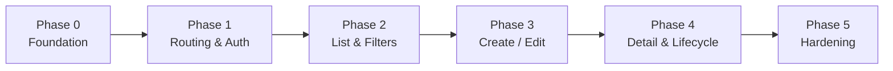

# Tenant Module — Implementation Plan

Plan for completing and shipping the **Tenants (Super Admin)** module in the KingFisher Tech Gold frontend.

**Sources:**

| Document | Status |
|----------|--------|
| `docs/project-overview.md` | **Not found** — plan uses [docs/README.md](../README.md), [project-patterns.md](../project-patterns.md), and [modules/tenant.md](./tenant.md) instead |
| [docs/modules/tenant-api.md](./tenant-api.md) | Swagger-derived API reference (live spec verified) |

**Current state:** ~80% of UI and service code exists under `src/features/tenants/` and `src/features/superadmin/`, but routes are **commented out**, hook/service layers are **duplicated**, and several API contract gaps remain. This plan moves from prototype → production-ready.

**Constraint:** No Redux in this project. Section 4 maps the requested “Redux slices” to **Zustand + TanStack Query** per [state-management.md](../state-management.md).

---

## Goals

| Goal | Success criteria |
|------|------------------|
| Enable super-admin surface | `/superadmin/*` routes live; login → dashboard → tenants |
| Full tenant CRUD + lifecycle | All 9 `/tenants` API operations wired with error handling |
| API alignment | Auth path, query params, and DTOs match Swagger / backend |
| Single code path | One service file, one hooks file set; dead code removed |
| Production UX | Loading, empty, error, confirm dialogs, server pagination |

---

## Phase overview



| Phase | Focus | Est. effort |
|-------|--------|-------------|
| **0** | API contract confirmation, env, cleanup | 0.5–1 day |
| **1** | Routes, super-admin auth, shell | 1 day |
| **2** | List page, search, filters, pagination, stats | 1–2 days |
| **3** | Create/edit forms, validation sync | 1–2 days |
| **4** | Detail page, lifecycle actions, error UX | 1 day |
| **5** | QA, edge cases, docs, optional tabs | 1 day |

---

## 1. Routes

### Target route tree

Register in `src/router/index.tsx` (uncomment and fix existing block):

```
/superadmin/login                          → SuperAdminLoginPage          (public)
/superadmin                                → SuperAdminProtectedRoute
  └── SuperAdminShell
        /superadmin/dashboard              → SuperAdminDashboardPage      (index redirect)
        /superadmin/tenants              → TenantListPage
        /superadmin/tenants/new          → TenantCreatePage
        /superadmin/tenants/:id          → TenantDetailPage
        /superadmin/tenants/:id/edit   → TenantEditPage
```

### Implementation tasks

| # | Task | Notes |
|---|------|-------|
| R1 | Uncomment super-admin imports and route block in `router/index.tsx` | Block already drafted at lines ~63–109 |
| R2 | Add index redirect: `/superadmin` → `/superadmin/dashboard` | Use `<Navigate replace />` |
| R3 | Ensure `SuperAdminLoginPage` is **outside** `SuperAdminProtectedRoute` | Public route |
| R4 | Wrap all other `/superadmin/*` routes in `SuperAdminProtectedRoute` → `SuperAdminShell` | Not `ProtectedRoute` / `AppShell` |
| R5 | Add `routeLabels` / breadcrumb entries if super-admin topbar needs them | Optional; check `config/routeLabels.ts` |
| R6 | Verify deep links (`/superadmin/tenants/:id`) work after login redirect | `location.state.from` on guard |

### Out of scope (this module)

- `/superadmin/billing`, `/monitoring`, `/settings`, `/audit-log` — sidebar entries exist but `enabled: false`
- Main ERP `/login` and tenant staff routes — separate auth flow

---

## 2. Pages

### Page inventory

| Page | File | Route | Status | Work remaining |
|------|------|-------|--------|----------------|
| Super admin login | `SuperAdminLoginPage.tsx` | `/superadmin/login` | Built | Fix API path; enable route |
| Platform dashboard | `SuperAdminDashboardPage.tsx` | `/superadmin/dashboard` | Built | Wire stats hook; enable route |
| Tenant list | `TenantListPage.tsx` | `/superadmin/tenants` | Built | Fix hooks import; pagination; errors |
| Create tenant | `TenantCreatePage.tsx` | `/superadmin/tenants/new` | Built | Error banner; validation sync |
| Tenant detail | `TenantDetailPage.tsx` | `/superadmin/tenants/:id` | Built | Mutation error UX; optional tabs |
| Edit tenant | `TenantEditPage.tsx` | `/superadmin/tenants/:id/edit` | Built | 404 state; error banner |

### Per-page responsibilities

**SuperAdminLoginPage**

- Form: email + password → `POST /auth/super-admin/login` (confirm path with backend)
- On success: `superAdminAuthStore.setSession` → navigate to `from` or `/superadmin/dashboard`
- Display `ApiError` via react-hook-form root error

**SuperAdminDashboardPage**

- `useTenantStatistics()` → `TenantStatsCards`
- CTA link to `/superadmin/tenants`
- Loading skeleton while stats fetch

**TenantListPage**

- Orchestrate: stats, filters, table, lifecycle mutations
- Own filter state: `search`, `status`, `page`, `limit`
- Confirm dialogs for delete/deactivate (already partial)
- Error boundary: list fetch failure + retry

**TenantCreatePage**

- `TenantForm` mode `create` → `useCreateTenant` mutation
- Navigate to detail on `201`
- Show API validation errors (409 duplicate slug/code)

**TenantEditPage**

- Load tenant via `useTenant(id)`; 404 if missing
- `TenantForm` mode `edit` → `useUpdateTenant`
- Navigate to detail on save

**TenantDetailPage**

- `DetailPageTemplate`: overview tab + placeholder Users/Billing tabs
- Action bar: Edit, Activate/Deactivate, Delete/Restore (rules in tenant.md)
- Refetch detail after lifecycle mutations

---

## 3. Components

### Keep (already implemented)

| Component | Path | Role |
|-----------|------|------|
| `TenantForm` | `features/tenants/components/TenantForm/` | Create/edit form |
| `TenantTable` | `features/tenants/components/TenantTable/` | List table |
| `TenantFilters` | `features/tenants/components/TenantFilters/` | Status tabs + search |
| `TenantStatsCards` | `features/tenants/components/TenantStatsCards/` | KPI cards |
| `TenantStatusBadge` | `features/tenants/components/TenantStatusBadge/` | Status pill |
| `TenantActionMenu` | `features/tenants/components/TenantActionMenu/` | Row actions menu |
| `SuperAdminShell` | `features/superadmin/layout/SuperAdminShell/` | Layout |
| `SuperAdminSidebar` | `features/superadmin/layout/SuperAdminSidebar/` | Nav |
| `SuperAdminTopbar` | `features/superadmin/layout/SuperAdminTopbar/` | Header + logout |
| `SuperAdminProtectedRoute` | `features/superadmin/components/` | Auth guard |
| `DetailPageTemplate` | `components/templates/` | Detail layout |

### Add or extend

| Component | Purpose | Priority |
|-----------|---------|----------|
| `TenantListPagination` | Server-side page controls (pattern from `AuditTable`) | P2 |
| `TenantListError` | Inline error + retry for list query | P2 |
| `TenantFormErrorBanner` | Root API error on create/edit | P3 |
| `TenantDeleteConfirm` | Replace `window.confirm` with `Modal` (optional) | P5 |
| `TenantUsersTab` | Placeholder until tenant-users API exists | P5 |
| `TenantBillingTab` | Placeholder until billing API exists | P5 |

### Remove / consolidate

| Item | Reason |
|------|--------|
| `features/tenants/services/tenants.api.ts` | Duplicate; references missing `@/services/apiClient` |
| `features/tenants/hooks/useTenant.ts` | Duplicate of hooks that should live in unified `useTenants.ts` |
| Merge exports so pages import from one hooks module | Fixes broken imports (`useTenantsList` not exported from `useTenants.ts`) |

---

## 4. State management (Redux slices equivalent)

> **No Redux.** Use the patterns below.

### 4.1 Zustand — `superAdminAuthStore`

**File:** `features/superadmin/store/superAdminAuthStore.ts`  
**Persist key:** `kfg-superadmin-auth`

| State | Purpose |
|-------|---------|
| `user`, `accessToken`, `refreshToken`, `isAuthenticated` | Super-admin session |

| Action | When |
|--------|------|
| `setSession(user, accessToken, refreshToken)` | After login |
| `setTokens(...)` | Token refresh (if implemented) |
| `logout()` | Logout + 401 interceptor |

**Tasks:**

- Confirm token refresh strategy (not implemented today; 401 → logout only)
- Align login endpoint path with Swagger (`/auth/super-admin/login`)

### 4.2 Zustand — `superAdminUiStore` (optional)

**File:** `features/superadmin/store/superAdminUiStore.ts`  
Use only if sidebar collapse or super-admin-specific UI state is needed. Not required for MVP.

### 4.3 TanStack Query — tenant cache

**Canonical files after cleanup:**

| File | Exports |
|------|---------|
| `hooks/useTenants.ts` | `tenantKeys`, `useTenants`, `useTenant`, `useTenantStatistics` |
| `hooks/useTenantMutations.ts` | `useTenantMutations()` bundle |

**Query key factory:**

```
['superadmin', 'tenants']
['superadmin', 'tenants', 'list', { search, status, page, limit }]
['superadmin', 'tenants', 'detail', id]
['superadmin', 'tenants', 'statistics']
```

**Mutations (invalidate `tenantKeys.all` on success):**

| Mutation | API |
|----------|-----|
| `createTenant` | `POST /tenants` |
| `updateTenant` | `PATCH /tenants/:id` |
| `deleteTenant` | `DELETE /tenants/:id` |
| `restoreTenant` | `PATCH /tenants/:id/restore` |
| `activateTenant` | `PATCH /tenants/:id/activate` |
| `deactivateTenant` | `PATCH /tenants/:id/deactivate` |

### 4.4 Local component state (pages)

| State | Page | Purpose |
|-------|------|---------|
| `search`, `status` | `TenantListPage` | Filters |
| `page`, `limit` | `TenantListPage` | Pagination (once backend confirms params) |
| `formError` | Create/Edit | Mutation error message |
| Dropdown `open` | `TenantActionMenu` | Menu UI |

### Redux → this module mapping

| Redux concept | Implementation |
|---------------|----------------|
| Slice | `tenantKeys` namespace + `superAdminAuthStore` |
| Async thunk | `useMutation` / `queryFn` in TanStack Query |
| Selector | `useQuery` result; `useSuperAdminAuthStore(s => s.field)` |
| Dispatch | `mutate()` / `mutateAsync()`; `setSession()` |

---

## 5. API services

### 5.1 HTTP client

**File:** `src/lib/superAdminApiClient.ts`

| Task | Detail |
|------|--------|
| Set `VITE_API_BASE_URL=https://kingfisherwings-backend.onrender.com` in `.env.example` | Align with deployed API |
| Document env in README | Currently only `VITE_API_URL` documented |
| Keep `ApiEnvelope<T>` unwrapping in service layer | Not in components |

### 5.2 Tenant service (single source of truth)

**File:** `features/tenants/services/tenant.service.ts`  
**Delete:** `tenants.api.ts`

| Method | HTTP | Maps to |
|--------|------|---------|
| `list(params)` | `GET /tenants` | `TenantListPage` |
| `getStatistics()` | `GET /tenants/statistics` | List + dashboard |
| `getById(id)` | `GET /tenants/:id` | Detail, edit |
| `create(dto)` | `POST /tenants` | Create page |
| `update(id, dto)` | `PATCH /tenants/:id` | Edit page |
| `softDelete(id)` | `DELETE /tenants/:id` | List, detail |
| `restore(id)` | `PATCH /tenants/:id/restore` | List, detail |
| `activate(id)` | `PATCH /tenants/:id/activate` | List, detail |
| `deactivate(id)` | `PATCH /tenants/:id/deactivate` | List, detail |

### 5.3 Super-admin auth service

**File:** `features/superadmin/services/superAdminAuth.service.ts`

| Task | Detail |
|------|--------|
| Change path from `/auth/superadmin/login` → `/auth/super-admin/login` | Per Swagger |
| Type response from first live login call | Document in `tenant-api.md` if shape differs |
| Handle `ApiError` for wrong credentials | Already on login page |

### 5.4 Types to add/fix

**File:** `features/tenants/types/tenant.types.ts`

| Type | Action |
|------|--------|
| `CreateTenantDto` | Export alias of `CreateTenantFormValues` |
| `UpdateTenantDto` | Export alias of `UpdateTenantFormValues` |
| `PaginationMeta` | Match `PaginationMetaResponse` from API |
| `TenantListResult` | `{ tenants: Tenant[]; meta: PaginationMeta }` |
| `subscription_plan`, `status` | Use string enums once backend documents; until then align with Zod |

### 5.5 Pre-implementation API confirmations (Phase 0)

| # | Question | Owner |
|---|----------|-------|
| A1 | Does `GET /tenants` support `page`, `limit`, `status`? | Backend |
| A2 | What is exact `subscription_plan` / `status` enum? | Backend |
| A3 | Full `UpdateTenantDto` field list? | Backend (OpenAPI empty) |
| A4 | Response envelope always `{ data, meta? }`? | Backend |
| A5 | Error codes for duplicate slug, 404, 401 | Backend |

---

## 6. Forms

### 6.1 `TenantForm` (single component, two modes)

**File:** `features/tenants/components/TenantForm/TenantForm.tsx`  
**Stack:** react-hook-form + `zodResolver`

| Section | Create | Edit |
|---------|--------|------|
| Company identity | name, display_name, code, slug, domain, website | name, display_name, domain, website (no code/slug) |
| Admin account | admin_first_name, admin_last_name, email, password | Hidden |
| Branding | logo_url, primary_color | Same |
| Regional settings | country_code, base_currency, timezone, language | Same |
| Business & contact | vat_number, cr_number, address, city, phone | Same |
| Subscription & limits | plan, status, FY start, max_users, max_branches, max_storage_gb | Same |

### 6.2 Implementation tasks

| # | Task |
|---|------|
| F1 | Add `error?: string` prop for API-level form banner (create/edit pages) |
| F2 | Map NestJS validation errors to field errors if backend returns `message[]` |
| F3 | Default values for create: sensible defaults (`primary_color`, `timezone`, `is_active`, limits) |
| F4 | Disable submit while `isSubmitting` (already present) |
| F5 | Cancel/back link on create → `/superadmin/tenants` |
| F6 | Date inputs for `trial_ends`, `subscription_ends` if required by product |

### 6.3 Out of scope

- `TenantLoginDto` form — separate tenant admin login flow (not super-admin module UI)
- `TenantChangePasswordDto` — future tenant settings screen

---

## 7. Validations

### 7.1 Zod schemas

**File:** `features/tenants/schemas/tenant.schema.ts`

### 7.2 Align frontend Zod with Swagger `CreateTenantDto`

| Field | Swagger required | Frontend today | Plan |
|-------|------------------|----------------|------|
| `code` | Yes | Yes + regex | Keep; align maxLength 20 |
| `name` | Yes | Yes | Add minLength 3 per Swagger |
| `display_name` | No | Required in Zod | **Relax** to optional OR confirm backend requires |
| `slug` | Yes | Yes | Align maxLength 100 (frontend 50) |
| `password` | Yes | min 8 | Keep stricter min 8 |
| `email` | Yes | Yes | Keep |
| `admin_first_name` | No | Required | Confirm with backend |
| `admin_*` | No | Required | Confirm provisioning needs |
| `subscription_plan` | object (undocumented) | enum | Keep enum until OpenAPI updated |
| `status` | object (undocumented) | enum `trial` \| `active` | Keep enum |
| `financial_year_start` | 1–12 | Yes | Keep |
| `max_*` | min 1 | Yes | Keep |
| `country_code` | string | regex `^[A-Z]{2}$` | Keep |
| `primary_color` | string | hex regex | Keep |
| `logo_url` | string | URL or empty | Keep |

### 7.3 `updateTenantSchema`

- Omit: `code`, `slug`, `password`, `admin_first_name`, `admin_last_name` (immutable)
- All other create fields patchable
- Revisit once `UpdateTenantDto` is published in OpenAPI

### 7.4 Validation tasks

| # | Task |
|---|------|
| V1 | Document final required-field matrix in `tenant-api.md` after backend sync |
| V2 | Add `.email()` on `email` field (already present) |
| V3 | Slug/code uppercase enforcement: code uppercase in UI; slug lowercase |
| V4 | Server-side error display for 409 conflict on create |

---

## 8. Tables

### 8.1 `TenantTable` columns

| Column | Source field | Notes |
|--------|--------------|-------|
| Code | `tenant.code` | `font-mono` |
| Company | `display_name` + `{slug}.fresagold.app` | Row click → detail |
| Plan | `subscription_plan` | Capitalize |
| Status | `TenantStatusBadge` | deleted / active / inactive |
| Users | `max_users` | Cap display (not live count until API) |
| Created | `created_at` | `toLocaleDateString()` |
| Actions | `TenantActionMenu` | Kebab menu |

### 8.2 Table behavior tasks

| # | Task |
|---|------|
| T1 | Loading row when `isLoading` (exists) |
| T2 | Empty state “No tenants found” (exists) |
| T3 | Add `TenantListPagination` below table when `meta.totalPages > 1` |
| T4 | Optional: use `components/ui/Table` primitives for design-system consistency (P5) |
| T5 | Show mutation pending state on action menu (disable or spinner) |
| T6 | Surface row-level error toast/banner if mutation fails |

### 8.3 Pagination design

Follow `AuditTable` pattern ([tables-and-pagination.md](../tables-and-pagination.md)):

- Query: `page`, `limit` (default 20)
- Display: “Showing {from}–{to} of {total}”
- Prev/next + page numbers from `meta.totalPages`
- Include `page`/`limit` in `tenantKeys.list(params)`

**Blocked on:** backend confirmation that `GET /tenants` accepts `page`, `limit`, `status` (Swagger currently only documents `search`).

---

## 9. Search and filters

### 9.1 `TenantFilters` component

**Current UI:**

- Status pills: `all` | `active` | `inactive` | `deleted`
- Search input: “Search company name or code…”

### 9.2 Filter → API mapping

| UI state | Query param | When sent |
|----------|-------------|-----------|
| `search` (string) | `search` | When non-empty |
| `status === 'all'` | *(omit)* | — |
| `status === 'active'` | `status=active` | Confirm param name with backend |
| `status === 'inactive'` | `status=inactive` | Confirm |
| `status === 'deleted'` | `status=deleted` | Confirm |
| `page` | `page` | When pagination enabled |
| `limit` | `limit` | Default 20 |

### 9.3 Implementation tasks

| # | Task |
|---|------|
| S1 | Debounce search input (300ms) before updating query key | Avoid excessive API calls |
| S2 | Reset `page` to 1 when search or status changes |
| S3 | Use `placeholderData: keepPreviousData` on list query (exists in `useTenants`) |
| S4 | Persist filters in URL search params (optional P5): `?status=active&search=acme&page=2` |
| S5 | Clear filters control when search + status active |

### 9.4 Statistics cards (above filters)

- `GET /tenants/statistics` on list page load
- Show: total, active, inactive, MRR (`TenantStatsCards`)
- Add `trial` count to cards (type exists; UI omits today)

---

## 10. Permissions

### 10.1 Auth model

Tenant module uses **super-admin auth boundary**, not main-app `PermissionKey` RBAC.

| Layer | Mechanism |
|-------|-----------|
| Login | `POST /auth/super-admin/login` → `superAdminAuthStore` |
| Route guard | `SuperAdminProtectedRoute` checks `isAuthenticated` |
| API | `superAdminApiClient` attaches Bearer token |
| 401 handling | Logout + redirect `/superadmin/login` |

**No `menu_*` permission** for tenant screens. Any authenticated super admin can perform all UI actions.

### 10.2 Implementation tasks

| # | Task |
|---|------|
| P1 | Enable `SuperAdminProtectedRoute` on all `/superadmin/*` routes except login |
| P2 | Redirect unauthenticated users to `/superadmin/login` with `state.from` |
| P3 | Do **not** use `ProtectedRoute`, `useAuth()`, or `AuthContext` in tenant pages |
| P4 | Ensure logout in `SuperAdminTopbar` clears store and navigates to login |
| P5 | Future: role matrix for super admins (read-only vs operator) — **out of scope** until backend supports it |

### 10.3 Separation from main ERP

| Surface | Auth store | Layout |
|---------|------------|--------|
| Main ERP (`/dashboard`, `/customers`, …) | `authStore` + `AuthContext` | `AppShell` |
| Super admin (`/superadmin/*`) | `superAdminAuthStore` | `SuperAdminShell` |

No shared session between the two.

---

## Implementation checklist (ordered)

### Phase 0 — Foundation

- [ ] Confirm API gaps with backend (A1–A5)
- [ ] Add `VITE_API_BASE_URL` to `.env.example`
- [ ] Fix super-admin login path to `/auth/super-admin/login`
- [ ] Delete `tenants.api.ts`; consolidate hooks into `useTenants.ts` + `useTenantMutations.ts`
- [ ] Add missing types (`CreateTenantDto`, `PaginationMeta`, etc.)

### Phase 1 — Routing & auth

- [ ] Uncomment and test `/superadmin/*` routes
- [ ] Login → dashboard → tenants navigation
- [ ] `SuperAdminProtectedRoute` redirect behavior
- [ ] Logout flow

### Phase 2 — List, search, filters

- [ ] Fix `TenantListPage` hook imports
- [ ] Wire `search` + `status` to `GET /tenants`
- [ ] Add server pagination (if backend supports)
- [ ] List error state + retry
- [ ] Stats cards + trial count
- [ ] Debounced search

### Phase 3 — Create & edit

- [ ] Sync Zod with Swagger/backend required fields
- [ ] Create flow with error banner
- [ ] Edit flow with 404 handling
- [ ] Handle 409 on duplicate create

### Phase 4 — Detail & lifecycle

- [ ] Detail page actions (activate, deactivate, delete, restore)
- [ ] Confirm dialogs + mutation feedback
- [ ] Refetch detail after mutations
- [ ] Correct action visibility when `deleted_at` set

### Phase 5 — Hardening

- [ ] Manual QA matrix (below)
- [ ] Remove dead code comments (“PASTE THIS AT…”)
- [ ] Update `tenant.md` router status to “enabled”
- [ ] Optional: URL-persisted filters, Modal confirms, Users/Billing tabs

---

## QA matrix (manual)

| Scenario | Expected |
|----------|----------|
| Unauthenticated visit `/superadmin/tenants` | Redirect to login |
| Login with valid super-admin creds | Land on dashboard |
| List loads with stats | Cards + table populated |
| Search by company name | Filtered results |
| Status filter `deleted` | Only soft-deleted tenants |
| Create tenant valid payload | 201 → detail page |
| Create duplicate slug | Error shown |
| Edit tenant | Saves; immutable fields hidden |
| Deactivate | Confirm → `is_active false` |
| Delete | Confirm → `deleted_at` set; restore available |
| 401 expired token | Logout → login |
| Pagination page 2 | Correct slice (when enabled) |

---

## Dependencies

| Dependency | Blocks |
|------------|--------|
| Backend `GET /tenants` pagination params | Server pagination (§8, §9) |
| `UpdateTenantDto` in OpenAPI | Final edit validation (§7) |
| `subscription_plan` / `status` enums in OpenAPI | Zod enum sync (§7) |
| Super-admin credentials for dev | End-to-end testing |
| `docs/project-overview.md` | Create if team wants single entry doc (optional) |

---

## Related documentation

- [Tenant module (frontend)](./tenant.md)
- [Tenant API](./tenant-api.md)
- [Module template](../module-template.md)
- [Project patterns](../project-patterns.md)
- [Authentication](../authentication.md)
