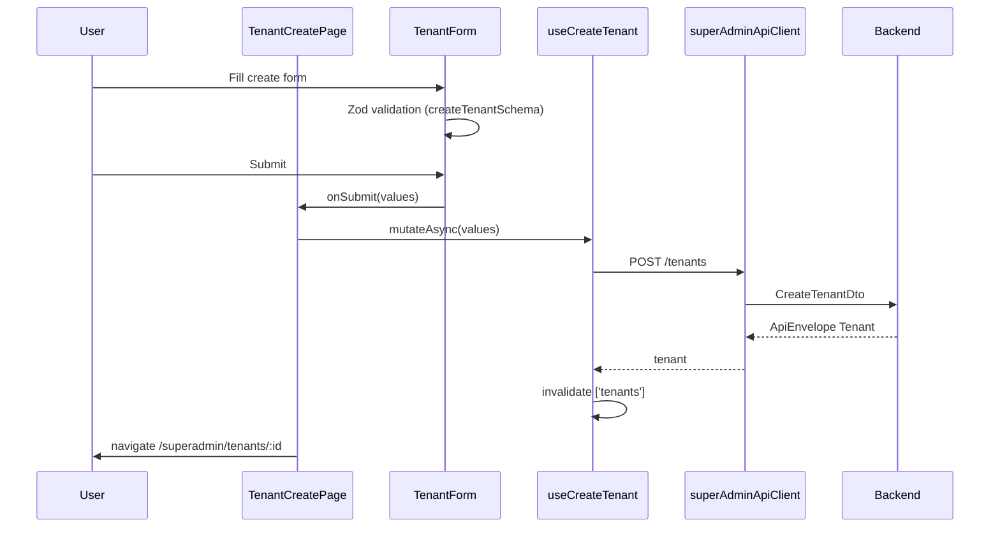
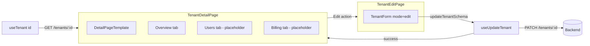

# Tenant Module

Platform-level tenant (workspace) management for **KINGFISHER WINGS LOGISTIC Super Admin**. This module lets platform operators provision, configure, activate/deactivate, and soft-delete customer organizations that run on the multi-tenant ERP.

> **Scope:** This is **not** the tenant-scoped user experience (`AuthUser.tenantId` in the main app). It lives under the super-admin surface and is isolated from the standard `authStore` / `AuthContext` login flow.

> **Router status:** All tenant routes are implemented in code but **commented out** in `src/router/index.tsx`. Enable the `/superadmin/*` block to activate this module in the running app.

---

## 1. Module purpose

| Goal | Description |
|------|-------------|
| **Provision workspaces** | Create a new tenant with company profile, admin account, branding, regional settings, and subscription limits |
| **Operate the tenant fleet** | List, search, and filter tenants by lifecycle status (active, inactive, deleted) |
| **Lifecycle management** | Activate, deactivate, soft-delete, and restore tenants without hard-deleting records |
| **Platform visibility** | Surface aggregate statistics (total, active, inactive, MRR) on the list page and super-admin dashboard |
| **Tenant inspection** | View read-only overview and planned Users/Billing tabs on the detail page |

Each provisioned tenant receives a workspace slug (e.g. `{slug}.fresagold.app`) and resource caps (`max_users`, `max_branches`, `max_storage_gb`).

---

## 2. Folder structure

```
src/features/tenants/
├── components/
│   ├── TenantActionMenu/       # Row-level kebab menu (view, edit, activate, …)
│   │   ├── TenantActionMenu.tsx
│   │   └── index.ts
│   ├── TenantFilters/          # Status tabs + search input
│   │   ├── TenantFilters.tsx
│   │   └── index.ts
│   ├── TenantForm/             # Create/edit form (react-hook-form + Zod)
│   │   ├── TenantForm.tsx
│   │   └── index.ts
│   ├── TenantStatsCards/       # KPI cards for platform statistics
│   │   ├── TenantStatsCards.tsx
│   │   └── index.ts
│   ├── TenantStatusBadge/      # Active / Inactive / Deleted pill
│   │   ├── TenantStatusBadge.tsx
│   │   └── index.ts
│   └── TenantTable/            # Sortable list table with actions
│       ├── TenantTable.tsx
│       └── index.ts
├── hooks/
│   ├── useTenants.ts           # TanStack Query: list + tenantKeys factory
│   ├── useTenant.ts            # Alternate hooks (list, detail, mutations) — see §4
│   ├── useTenantMutations.ts   # Consolidated mutations via tenantService
│   └── useTenantStatistics.ts  # Statistics query via tenantService
├── pages/
│   ├── TenantListPage.tsx      # List + filters + stats + table
│   ├── TenantCreatePage.tsx    # New tenant form
│   ├── TenantEditPage.tsx      # Edit existing tenant
│   └── TenantDetailPage.tsx    # Read-only detail with action bar
├── schemas/
│   └── tenant.schema.ts        # Zod create/update schemas
├── services/
│   ├── tenant.service.ts       # Primary API layer (superAdminApiClient)
│   └── tenants.api.ts          # Alternate API layer (references @/services/apiClient)
└── types/
    └── tenant.types.ts         # Tenant, params, statistics interfaces
```

### Related code (outside `features/tenants/`)

| Path | Role |
|------|------|
| `src/lib/superAdminApiClient.ts` | Axios client + `ApiEnvelope<T>` for super-admin API |
| `src/features/superadmin/` | Login, shell layout, route guard, dashboard (consumes tenant stats) |
| `src/components/templates/DetailPageTemplate.tsx` | Shared detail layout used by `TenantDetailPage` |

---

## 3. Pages and components

### Pages

| Page | Route (intended) | File | Responsibility |
|------|------------------|------|----------------|
| **Tenant list** | `/superadmin/tenants` | `TenantListPage.tsx` | Stats cards, filters, table, “+ New Tenant” CTA |
| **Create tenant** | `/superadmin/tenants/new` | `TenantCreatePage.tsx` | Renders `TenantForm` in `create` mode; redirects to detail on success |
| **Tenant detail** | `/superadmin/tenants/:id` | `TenantDetailPage.tsx` | Overview tab, placeholder Users/Billing tabs, lifecycle actions |
| **Edit tenant** | `/superadmin/tenants/:id/edit` | `TenantEditPage.tsx` | Renders `TenantForm` in `edit` mode; redirects to detail on save |

### Module components

| Component | Props / behavior |
|-----------|------------------|
| `TenantStatsCards` | Renders `total`, `active`, `inactive`, `mrr` from `TenantStatistics` |
| `TenantFilters` | Status pills: `all`, `active`, `inactive`, `deleted`; search by company name or code |
| `TenantTable` | Columns: code, company (+ slug), plan, status badge, max users, created date, action menu |
| `TenantStatusBadge` | `Deleted` if `deleted_at` set; else `Active` / `Inactive` from `is_active` |
| `TenantActionMenu` | Context menu: View, Edit, Activate/Deactivate, Delete/Restore (presentational; confirm in parent) |
| `TenantForm` | Single-page form with sections: Company identity, Admin account (create only), Branding, Regional, Business & contact, Subscription & limits |

### Super-admin shell (host layout)

When routes are enabled, tenant pages render inside:

```
SuperAdminProtectedRoute
  └── SuperAdminShell
        ├── SuperAdminSidebar   (links to /superadmin/tenants)
        ├── SuperAdminTopbar
        └── <Outlet />          ← tenant pages
```

`SuperAdminDashboardPage` also consumes `TenantStatsCards` and links to the tenant list.

---

## 4. Redux slices and actions

**This project does not use Redux.** There are no `createSlice`, Redux store, or RTK Query definitions in the repository.

The tenant module uses the following equivalents:

### Zustand — `superAdminAuthStore`

**File:** `src/features/superadmin/store/superAdminAuthStore.ts`  
**Persist key:** `kfg-superadmin-auth`

| State field | Type | Purpose |
|-------------|------|---------|
| `user` | `SuperAdminUser \| null` | Logged-in platform admin |
| `accessToken` | `string \| null` | Bearer token for `superAdminApiClient` |
| `refreshToken` | `string \| null` | Stored alongside access token |
| `isAuthenticated` | `boolean` | Drives `SuperAdminProtectedRoute` |

| Action | Behavior |
|--------|----------|
| `setSession(user, accessToken, refreshToken)` | Set full session after super-admin login |
| `setTokens(accessToken, refreshToken)` | Update tokens only |
| `logout()` | Clear all session fields |

`superAdminApiClient` reads `accessToken` on every request and calls `logout()` + redirects to `/superadmin/login` on 401 when already authenticated.

### TanStack Query — server cache & mutations

Two parallel hook implementations exist (consolidation recommended):

#### A. `useTenants.ts` + `useTenantMutations.ts` + `useTenantStatistics.ts` (service-based)

Uses `tenantService` and a structured query-key factory:

```typescript
tenantKeys = {
  all: ['superadmin', 'tenants'],
  list: (params) => [...tenantKeys.all, 'list', params],
  detail: (id) => [...tenantKeys.all, 'detail', id],
  statistics: () => [...tenantKeys.all, 'statistics'],
}
```

| Hook / export | Type | Action |
|---------------|------|--------|
| `useTenants(params)` | `useQuery` | Fetch paginated tenant list |
| `useTenantStatistics()` | `useQuery` | Fetch platform statistics (`staleTime: 5 min`) |
| `useTenantMutations()` | `useMutation` bundle | `createTenant`, `updateTenant`, `deleteTenant`, `restoreTenant`, `activateTenant`, `deactivateTenant` — each invalidates `tenantKeys.all` on success |

#### B. `useTenant.ts` (alternate — pages currently import from `useTenants`)

Exports hooks used by the page components:

| Hook | Type | Action |
|------|------|--------|
| `useTenantsList(params)` | `useQuery` | List tenants (`queryKey: ['tenants', params]`) |
| `useTenant(id)` | `useQuery` | Single tenant by id |
| `useTenantStatistics()` | `useQuery` | Statistics |
| `useCreateTenant()` | `useMutation` | `POST /tenants`; invalidates `['tenants']` |
| `useUpdateTenant(id)` | `useMutation` | `PATCH /tenants/:id`; invalidates detail + list |
| `useActivateTenant()` | `useMutation` | `PATCH /tenants/:id/activate` |
| `useDeactivateTenant()` | `useMutation` | `PATCH /tenants/:id/deactivate` |
| `useDeleteTenant()` | `useMutation` | `DELETE /tenants/:id` (soft delete) |
| `useRestoreTenant()` | `useMutation` | `PATCH /tenants/:id/restore` |

> **Note:** Pages import from `../hooks/useTenants`, but the list/detail/mutation hooks are defined in `useTenant.ts`. `useTenants.ts` only exports `useTenants` + `tenantKeys`. This is a known wiring inconsistency — see [Missing items](#known-gaps).

### Local component state

| Location | State |
|----------|-------|
| `TenantListPage` | `search`, `status` filter |
| `TenantActionMenu` | Dropdown `open` / click-outside handling |

---

## 5. API endpoints used

All tenant CRUD calls go through **`superAdminApiClient`** (`tenant.service.ts`), unless the alternate `tenants.api.ts` path is used (references a non-existent `@/services/apiClient`).

**Base URL:** `import.meta.env.VITE_API_BASE_URL` (fallback: `/api`)

**Auth:** `Authorization: Bearer <superAdminAuthStore.accessToken>`

**Response envelope:**

```typescript
interface ApiEnvelope<T> {
  data: T;
  message?: string;
  success?: boolean;
  meta?: PaginationMeta;  // on list endpoints
}
```

### Endpoints

| Method | Path | Service method | Used by |
|--------|------|----------------|---------|
| `GET` | `/tenants` | `tenantService.list(params)` | List page, filters |
| `GET` | `/tenants/:id` | `tenantService.getById(id)` | Detail, edit pages |
| `GET` | `/tenants/statistics` | `tenantService.getStatistics()` | List stats, super-admin dashboard |
| `POST` | `/tenants` | `tenantService.create(dto)` | Create page |
| `PATCH` | `/tenants/:id` | `tenantService.update(id, dto)` | Edit page |
| `DELETE` | `/tenants/:id` | `tenantService.softDelete(id)` | List/detail delete action |
| `PATCH` | `/tenants/:id/restore` | `tenantService.restore(id)` | List/detail restore action |
| `PATCH` | `/tenants/:id/activate` | `tenantService.activate(id)` | Activate action |
| `PATCH` | `/tenants/:id/deactivate` | `tenantService.deactivate(id)` | Deactivate action |

### List query parameters (`TenantListParams`)

| Param | Type | Description |
|-------|------|-------------|
| `page` | `number` | Page number (optional) |
| `limit` | `number` | Page size (optional) |
| `search` | `string` | Company name or code search |
| `status` | `string` | `active` \| `inactive` \| `deleted` (omit for all) |

### Planned endpoints (not wired)

Referenced as placeholders in `TenantDetailPage`:

- Tenant users list (Users tab)
- Tenant billing (Billing tab)

---

## 6. Forms and validations

**Library:** React Hook Form + `@hookform/resolvers/zod`  
**Schemas:** `src/features/tenants/schemas/tenant.schema.ts`

### Create schema (`createTenantSchema`)

| Field | Validation |
|-------|------------|
| `code` | `/^[A-Z0-9-]{3,20}$/` — uppercase, numbers, hyphens |
| `name` | Required string |
| `display_name` | Required string |
| `slug` | `/^[a-z0-9-]{3,50}$/` — lowercase slug |
| `password` | Min 8 characters (admin temporary password) |
| `admin_first_name`, `admin_last_name` | Required |
| `domain`, `website` | Optional |
| `logo_url` | Valid URL or empty |
| `primary_color` | Hex color `#RGB` or `#RRGGBB` |
| `language`, `base_currency`, `timezone` | Required |
| `country_code` | ISO 3166-1 alpha-2 (`/^[A-Z]{2}$/`) |
| `financial_year_start` | Integer 1–12 |
| `vat_number`, `cr_number` | Optional |
| `address`, `city`, `phone` | Required |
| `email` | Valid email (admin email on create) |
| `subscription_plan` | `starter` \| `growth` \| `enterprise` |
| `status` | `trial` \| `active` |
| `trial_ends`, `subscription_ends` | Optional date strings |
| `max_users`, `max_branches`, `max_storage_gb` | Integers ≥ 1 |
| `is_active` | Boolean |

### Update schema (`updateTenantSchema`)

Same as create **except** these fields are **omitted** (immutable after provisioning):

- `code`
- `slug`
- `password`
- `admin_first_name`
- `admin_last_name`

### Form sections (`TenantForm`)

| Section | Create | Edit |
|---------|--------|------|
| Company identity | ✅ incl. code & slug | ✅ name, display_name, domain, website only |
| Admin account | ✅ | Hidden |
| Branding | ✅ logo_url, primary_color | ✅ |
| Regional settings | ✅ country, currency, timezone, language | ✅ |
| Business & contact | ✅ VAT, CR, address, city, phone | ✅ |
| Subscription & limits | ✅ plan, status, FY start, caps | ✅ |

Submit button label: **“Create tenant”** (create) / **“Save changes”** (edit).

---

## 7. Role permissions

The tenant module is **not** gated by the main app `PermissionKey` RBAC (`menu_*` keys in `auth.types.ts`). Access is controlled entirely by the **super-admin authentication boundary**.

| Layer | Mechanism |
|-------|-----------|
| **Route guard** | `SuperAdminProtectedRoute` — requires `superAdminAuthStore.isAuthenticated === true` |
| **Login** | Separate flow via `SuperAdminLoginPage` → `POST /auth/superadmin/login` |
| **API auth** | `superAdminApiClient` attaches super-admin JWT; 401 → logout + redirect `/superadmin/login` |
| **Tenant user RBAC** | Not applicable — platform admins manage tenants; tenant users use the main `/login` flow with `tenantId` in their JWT |

There is **no per-action permission matrix** (e.g. “can delete tenant”) in the frontend today. Any authenticated super-admin can perform all lifecycle actions exposed in the UI.

### Intended routes (when enabled)

| Route | Guard |
|-------|-------|
| `/superadmin/login` | Public |
| `/superadmin/dashboard` | `SuperAdminProtectedRoute` |
| `/superadmin/tenants` | `SuperAdminProtectedRoute` |
| `/superadmin/tenants/new` | `SuperAdminProtectedRoute` |
| `/superadmin/tenants/:id` | `SuperAdminProtectedRoute` |
| `/superadmin/tenants/:id/edit` | `SuperAdminProtectedRoute` |

---

## 8. Reusable components

### Within the tenant module

| Component | Reuse pattern |
|-----------|---------------|
| `TenantForm` | Shared create/edit form; mode prop switches schema and visible fields |
| `TenantTable` | List rendering; accepts action callbacks from parent (confirm logic stays in page) |
| `TenantActionMenu` | Presentational dropdown; reusable per row |
| `TenantStatusBadge` | Status pill from `is_active` + `deleted_at` |
| `TenantFilters` | Controlled search + status filter bar |
| `TenantStatsCards` | KPI grid; also used on `SuperAdminDashboardPage` |

### Shared templates (cross-module)

| Component | Path | Used for |
|-----------|------|----------|
| `DetailPageTemplate` | `src/components/templates/DetailPageTemplate.tsx` | Tenant detail: title, status tone, tabs, action buttons, back navigation |

### Not used by tenant module

| Component | Notes |
|-----------|-------|
| `ListPageTemplate` | Tenant list uses custom layout instead |
| `StepFormTemplate` | Tenant form is single-page, not a wizard |
| Main app `AppShell` / `Sidebar` | Super-admin uses `SuperAdminShell` |

---

## 9. Business rules

### Provisioning

1. **Immutable identity fields** — `code`, `slug`, admin password, and admin name are set once at creation and cannot be edited afterward (`updateTenantSchema` omits them).
2. **Workspace URL** — Displayed as `{slug}.fresagold.app` in table and detail subtitle.
3. **Admin email** — Captured at create time as the tenant's primary `email` field; not re-shown as a separate editable block in edit mode.
4. **Subscription plans** — `starter`, `growth`, or `enterprise`.
5. **Initial status** — `trial` or `active` at creation time.

### Lifecycle states

| State | Condition | UI label |
|-------|-----------|----------|
| **Active** | `is_active === true` && `deleted_at` is null | Green “Active” badge |
| **Inactive** | `is_active === false` && `deleted_at` is null | Gray “Inactive” badge |
| **Deleted** | `deleted_at` is set | Red “Deleted” badge |

`deleted_at` and `is_active` are **independent** — soft delete is not the same as deactivation.

### Actions & confirmations

| Action | Confirm? | Effect (expected backend behavior) |
|--------|----------|-------------------------------------|
| **Deactivate** | Yes — “Users will be logged out.” | Sets tenant inactive; ends user sessions |
| **Activate** | No | Re-enables tenant |
| **Delete** | Yes — “can be restored later.” | Soft delete (`DELETE`); sets `deleted_at` |
| **Restore** | No | Clears soft delete |
| **Edit** | N/A | Hidden when tenant is deleted |
| **View** | N/A | Always available |

### Deleted tenant restrictions

When `deleted_at` is present:

- Show **Restore** instead of Edit, Activate/Deactivate, Delete
- Detail page status tone: `rose` (“Deleted”)
- Action menu: View + Restore only

### Resource limits

Enforced at the schema level (minimum 1):

- `max_users`
- `max_branches`
- `max_storage_gb`

Backend is expected to enforce these caps at runtime for each tenant.

### Filtering

- Status filter `all` sends no `status` query param
- Other filters map to `active`, `inactive`, or `deleted`
- Search is passed as `search` query param (company name or code)

### Unimplemented UI areas

- **Users tab** — “Wire this once a tenant-users endpoint exists.”
- **Billing tab** — “Wire this once billing endpoints exist.”
- **Trial count** — `TenantStatistics.trial` is typed but not shown in `TenantStatsCards`

### Known gaps (implementation)

| Gap | Detail |
|-----|--------|
| Routes disabled | Super-admin block commented in `src/router/index.tsx` |
| Duplicate service layers | `tenant.service.ts` (active) vs `tenants.api.ts` (references missing `apiClient`) |
| Duplicate hook files | `useTenants.ts` vs `useTenant.ts`; pages import symbols not exported from `useTenants.ts` |
| Missing type exports | `CreateTenantDto`, `UpdateTenantDto`, `PaginationMeta` referenced by `tenant.service.ts` but not defined in `tenant.types.ts` |
| Env var mismatch | `VITE_API_BASE_URL` (super-admin) vs `VITE_API_URL` (main app) |

---

## 10. Data flow diagram

### List & lifecycle actions

```mermaid
flowchart TB
  subgraph auth [Super Admin Auth]
    SAStore[superAdminAuthStore]
    SAClient[superAdminApiClient]
    SAStore -->|Bearer token| SAClient
  end

  subgraph page [TenantListPage]
    Filters[TenantFilters]
    Stats[TenantStatsCards]
    Table[TenantTable]
    Menu[TenantActionMenu]
  end

  subgraph query [TanStack Query]
    QStats[useTenantStatistics]
    QList[useTenantsList]
    MAct[useActivate / Deactivate / Delete / Restore]
  end

  subgraph api [Backend API]
    GETstats[GET /tenants/statistics]
    GETlist[GET /tenants?search&status]
    PATCHact[PATCH activate|deactivate|restore]
    DEL[DELETE /tenants/:id]
  end

  Filters -->|search, status state| QList
  QList --> SAClient --> GETlist
  GETlist --> Table
  QStats --> SAClient --> GETstats
  GETstats --> Stats
  Menu -->|user action| MAct
  MAct --> SAClient
  SAClient --> PATCHact
  SAClient --> DEL
  MAct -->|invalidate queries| QList
```

### Create tenant



### Detail view & edit



### Auth boundary (tenant module vs main app)

```mermaid
flowchart TB
  subgraph main [Main ERP App]
    Login[/login]
    AuthStore[authStore + AuthContext]
    TenantJWT[JWT with tenantId]
    ERP[Tenant-scoped modules]
    Login --> AuthStore --> TenantJWT --> ERP
  end

  subgraph platform [Super Admin Platform]
    SALogin[/superadmin/login]
    SAStore[superAdminAuthStore]
    SAJWT[Super Admin JWT]
    Tenants[Tenant module]
    SALogin --> SAStore --> SAJWT --> Tenants
  end

  Tenants -.->|provisions| TenantJWT
```

---

## Related documentation

- [Tenant API reference](./tenant-api.md)
- [Tenant implementation plan](./tenant-implementation-plan.md)
- [Backend architecture — Super-admin API](../backend-architecture.md#super-admin-api-separate-client)
- [Authentication — Super-admin flow](../authentication.md#10-super-admin-authentication-separate-flow)
- [Modules overview](../modules.md#super-admin-multi-tenant-platform)
- [Missing documentation](../missing-documentation.md)
