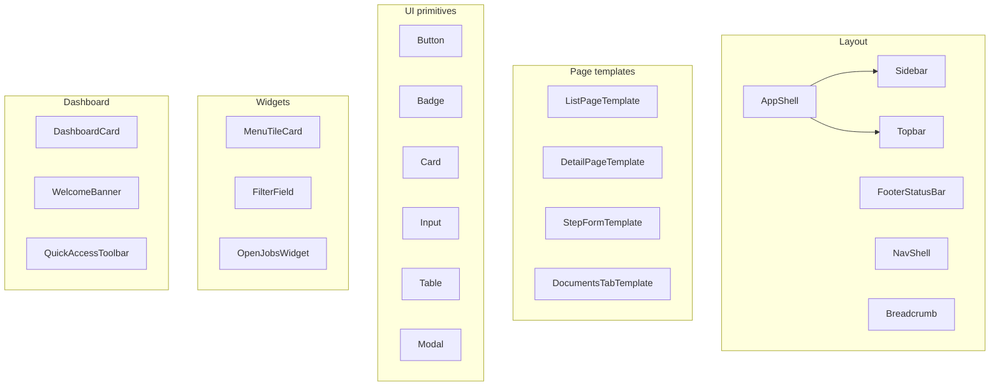

# Reusable Components

Catalog of shared UI building blocks in the KingFisher Tech Gold frontend. Module-specific components live under `src/features/<module>/components/`.

---

## Component map



---

## Layout (`src/components/layout/`)

| Component | Purpose |
|-----------|---------|
| `AppShell` | Protected app chrome: sidebar, topbar, main `<Outlet />`, footer status bar |
| `Sidebar` | RBAC-filtered main navigation |
| `Topbar` | Page title, theme switcher, profile dropdown |
| `FooterStatusBar` | User email, timestamp, timezone |
| `NavShell` | Alternate nav wrapper for marketing-style pages |
| `Breadcrumb` | Breadcrumb trail |
| `ProfileDropdown` | User menu + logout |
| `LogoutButton` | Sign-out trigger |
| `ThemeSwitcher` | Theme class toggle |
| `MasterListPage` | Generic master-data list scaffold (header, filter row, table, pagination) |

### Super-admin layout (`src/features/superadmin/layout/`)

| Component | Purpose |
|-----------|---------|
| `SuperAdminShell` | Sidebar + topbar + outlet |
| `SuperAdminSidebar` | Platform admin nav (dashboard, tenants, billing…) |
| `SuperAdminTopbar` | Super-admin header bar |

---

## UI primitives (`src/components/ui/`)

Exported from `src/components/ui/index.ts`:

| Component | File | Notes |
|-----------|------|-------|
| `Button` | `Button/Button.tsx` | Variants: primary, secondary; Storybook story exists |
| `Badge` | `Badge/Badge.tsx` | Variants: success, warning, danger, info, neutral |
| `Card` | `Card/Card.tsx` | `padding` prop (`none` for flush tables) |
| `Input` | `Input/Input.tsx` | Styled text input |
| `Table` | `Table/Table.tsx` | Composable: `Table`, `TableHeader`, `TableBody`, `TableRow`, `TableHead`, `TableCell` |
| `Modal` | `Modal/Modal.tsx` | Dialog overlay |

### Additional UI (not in barrel export)

| Component | Purpose |
|-----------|---------|
| `RoleBadge` | Colored pill for user role slug |
| `FinancialVisibilityIndicator` | Shows/hides financial KPIs per user config |

### Table primitive API

```tsx
<Table>
  <TableHeader>
    <TableRow>
      <TableHead>Column</TableHead>
    </TableRow>
  </TableHeader>
  <TableBody>
    <TableRow>
      <TableCell mono>JOB-001</TableCell>  {/* mono = font-mono text-xs */}
    </TableRow>
  </TableBody>
</Table>
```

Uses CSS variables (`--color-neutral-*`). Preferred for design-system-aligned lists (`CustomerList`, `DashboardPage`).

---

## Page templates (`src/components/templates/`)

| Template | Purpose | Key props |
|----------|---------|-----------|
| `ListPageTemplate` | Generic searchable list with status tabs | `columns`, `data`, `isLoading`, `primaryAction`, `statusTabs` |
| `DetailPageTemplate` | Tabbed detail with action bar | `title`, `tabs`, `actions`, `statusLabel`, `onBack` |
| `StepFormTemplate` | Multi-step wizard | Step navigation |
| `DocumentsTabTemplate` | Document attachment tabs | Used on entity detail screens |

**Used by:** `TenantDetailPage` → `DetailPageTemplate`; Tenant list uses custom table instead of `ListPageTemplate`.

---

## Widgets (`src/components/widgets/`)

| Component | Purpose |
|-----------|---------|
| `MenuTileCard` | Hub page tile (title, description, icon, path) |
| `MenuGridPage` | Grid wrapper for menu tiles |
| `FilterField` | Label + select wrapper for legacy filter grids |
| `OpenJobsWidget` | Dashboard KPI — open jobs count |
| `PendingQuotationsWidget` | Pending quotations summary |
| `ShipmentsByModeWidget` | Chart data by transport mode |
| `UpcomingEtdsWidget` | Upcoming ETD list |
| `PendingTasksWidget` | Task list |
| `RecentJobsWidget` | Recent jobs table |
| `RevenueMTDWidget` | Revenue month-to-date (permission-aware) |

Widgets fetch their own data via `axiosInstance` in `useEffect`.

---

## Dashboard (`src/components/dashboard/`)

| Component | Purpose |
|-----------|---------|
| `WelcomeBanner` | Personalized greeting |
| `QuickAccessToolbar` | Shortcut links |
| `DashboardCard` | Section card with loading/empty states |
| `DashboardLayout` | Dashboard grid wrapper |
| `ColorHeaderCard` | Card with colored header strip |
| `QuickActionsBar` / `QuickAccessToolbar` | Action shortcuts |
| `TodoDetailCell` | Expandable todo cell |
| `WidgetSettingsPanel` | Homepage widget visibility editor |
| `widgetRegistry.ts` | Widget id → component map |
| `defaultConfig.ts` | Default homepage layout |

---

## Routing & auth components

| Component | Purpose |
|-----------|---------|
| `ProtectedRoute` | Auth + permission + role gate; renders `<Outlet />` or redirect |
| `AuthLoadingGate` | Full-page spinner during session restore |
| `AppShellSkeleton` | Layout skeleton while auth resolves |

Super-admin: `SuperAdminProtectedRoute` in `features/superadmin/`.

---

## Skeletons (`src/components/skeletons/`)

| Component | Purpose |
|-----------|---------|
| `AuthLoadingGate` | Blocks router until `/api/auth/me` completes |
| `AppShellSkeleton` | Sidebar + content placeholder |
| `SkeletonPrimitives` | `FullPageSpinner`, base skeleton shapes |

---

## Domain-specific shared components

### Audit (`src/components/audit/`)

| Component | Purpose |
|-----------|---------|
| `AuditTable` | Full audit log table **with real server pagination** |
| `AuditFilters` | Filter bar for audit query |
| `AuditDiffView` | Before/after JSON diff expander |

### Sessions (`src/components/sessions/`)

| Component | Purpose |
|-----------|---------|
| `SessionList` | Active sessions table |
| `RevokeConfirmModal` | Confirm session revocation |

### Login security (`src/components/loginSecurity/`)

| Component | Purpose |
|-----------|---------|
| `LoginSecurityForm` | IP/MAC/office hours settings |
| `OfficeHoursEditor` | Weekly hours grid |
| `TagInput` | Tag list for IP/MAC ranges |

### Marketing (`src/components/marketing/`)

| Component | Purpose |
|-----------|---------|
| `Navbar`, `Footer` | Public site chrome |
| `sections/Hero`, `Features`, `Modules`, … | Landing page sections |
| `3d/HeroScene` | Three.js hero animation |

---

## Module-local components (Tenant reference)

Under `src/features/tenants/components/`:

| Component | Reusable pattern |
|-----------|------------------|
| `TenantForm` | Mode-based create/edit form |
| `TenantTable` | Data table with loading/empty states |
| `TenantFilters` | Controlled filter bar |
| `TenantActionMenu` | Row kebab menu |
| `TenantStatusBadge` | Status pill |
| `TenantStatsCards` | KPI card grid (also used on super-admin dashboard) |

Each folder: `ComponentName.tsx` + `index.ts` barrel export.

---

## Choosing a component

| Need | Use |
|------|-----|
| App page with sidebar | Render inside `AppShell` via router |
| Module landing hub | `MenuTileCard` + `*Menu.ts` config |
| Standard data table | `components/ui/Table` primitives |
| Full list page scaffold | `ListPageTemplate` or `MasterListPage` |
| Entity detail with tabs | `DetailPageTemplate` |
| Dashboard KPI | `components/widgets/*` or `DashboardCard` |
| Form fields (styled) | `Input` primitive or inline Tailwind (Tenant form) |
| Status pill | `Badge` or module-specific badge component |
| Loading gate | `AuthLoadingGate`, `AppShellSkeleton` |

---

## Storybook

`Button` has a Storybook story (`Button.stories.tsx`). Run `npm run storybook` on port 6006. Most components are not yet documented in Storybook.

---

## Related docs

- [Tables and pagination](./tables-and-pagination.md)
- [Forms](./forms.md)
- [Module template](./module-template.md)
- [Project patterns](./project-patterns.md)
