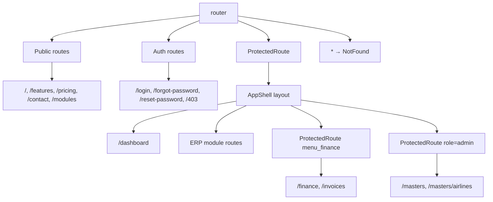

# Routing Structure

The application uses **React Router 7** with `createBrowserRouter` and a single router definition at `src/router/index.tsx`, mounted from `src/main.tsx` via `<RouterProvider router={router} />`.

> **Note:** `src/App.tsx` contains an older, unused router with more placeholders. Only `src/router/index.tsx` is active.

---

## Bootstrap chain

```
main.tsx
  └── RouterProvider(router from src/router/index.tsx)
```

Auth wraps the router (not inside it):

```
QueryClientProvider → AuthProvider → AuthLoadingGate → RouterProvider
```

---

## Route categories



### 1. Public marketing routes

No authentication required.

| Path | Page |
|------|------|
| `/` | `Home` |
| `/features` | `FeaturesPage` |
| `/pricing` | `PricingPage` |
| `/contact` | `ContactPage` |
| `/modules` | `ModulesPage` |

### 2. Auth routes

| Path | Page |
|------|------|
| `/login` | `LoginPage` |
| `/forgot-password` | `ForgotPasswordPage` |
| `/reset-password` | `ResetPasswordPage` |
| `/403` | `Forbidden` |

### 3. Protected ERP routes

Wrapped in:

```tsx
{
  element: <ProtectedRoute />,
  children: [
    {
      element: <AppShell title="KingFisher Tech Gold" />,
      children: [ /* all app routes */ ],
    },
  ],
}
```

`ProtectedRoute` checks `useAuth().isAuthenticated`. While auth is loading, it renders `AppShellSkeleton`.

### 4. Nested permission guards

**Finance** — requires `menu_finance`:

```tsx
{
  element: <ProtectedRoute requirePermissions={['menu_finance']} />,
  children: [
    { path: '/finance', ... },
    { path: '/invoices', ... },
    { path: '/invoices/:id', ... },
  ],
}
```

**Masters** — requires `admin` role:

```tsx
{
  element: <ProtectedRoute requireRole="admin" />,
  children: [
    { path: '/masters', ... },
    { path: '/masters/airlines', ... },
  ],
}
```

Denied access redirects to `/403`.

### 5. Catch-all

```tsx
{ path: '*', element: <NotFound /> }
```

---

## URL conventions

| Pattern | Example | Purpose |
|---------|---------|---------|
| Module hub | `/customers`, `/hr`, `/sales` | Tile menu landing page |
| Submodule list | `/customer-service/shipments` | Feature list screen |
| Nested resource | `/quotations/all` | Sub-feature under hub |
| CRUD detail | `/customers/:id` | Dynamic segment (many are placeholders) |
| Jobs by mode | `/jobs/air-export`, `/jobs/sea-export/:id` | Mode-specific job routes |

### Active module route map (summary)

| Hub | Example child routes |
|-----|---------------------|
| `/dashboard` | — |
| `/customers` | `/customer-service/*` (7 screens) |
| `/quotations` | `/quotations/all`, `tariff-master`, `zip-distance-master` |
| `/documentation` | `all-jobs`, `boe-dashboard`, `bayan-edi-*` |
| `/management` | `user-access`, `complaints`, `management-dashboard`, … |
| `/nvocc` | `all-jobs`, `booking-list`, `enquiry-list`, … |
| `/hr` | `employee-master`, `leave-request`, `pay-roll`, `salary-upload` |
| `/sales` | `call-sheet`, `lead`, `sales-dashboard`, … |
| `/jobs/*` | Placeholders for air/sea export/import |
| `/finance`, `/masters` | Permission-gated placeholders |

Full route inventory: [modules.md](./modules.md).

---

## Super-admin routes (commented out)

The router includes a **disabled** block for platform admin:

```tsx
// /superadmin/login
// /superadmin → SuperAdminProtectedRoute → SuperAdminShell
//   /superadmin/dashboard
//   /superadmin/tenants
//   /superadmin/tenants/new
//   /superadmin/tenants/:id
//   /superadmin/tenants/:id/edit
```

Uncomment imports and route block in `src/router/index.tsx` to enable. Uses `SuperAdminProtectedRoute` (not main `ProtectedRoute`).

---

## Layout nesting

```
ProtectedRoute
  └── AppShell (Sidebar + Topbar + FooterStatusBar)
        └── <Outlet />  ← page component renders here
```

Super-admin (when enabled):

```
SuperAdminProtectedRoute
  └── SuperAdminShell (SuperAdminSidebar + SuperAdminTopbar)
        └── <Outlet />
```

Marketing pages render **without** `AppShell` — full-page layouts with their own `Navbar`/`Footer`.

---

## Navigation sources

| Source | Mechanism |
|--------|-----------|
| **Sidebar** | `NavLink` items in `Sidebar.tsx`, filtered by `PermissionKey` |
| **Menu hubs** | `MenuTileCard` + config arrays (`customerServiceMenu.ts`, etc.) |
| **Programmatic** | `useNavigate()` in pages and tables |
| **Login redirect** | `Navigate to="/login" state={{ from: location }}` in `ProtectedRoute` |

---

## Adding a new route

1. Create page component under `src/features/<module>/pages/` or `src/pages/<module>/`.
2. Import in `src/router/index.tsx`.
3. Add inside `AppShell` children (or nested `ProtectedRoute` if permission-gated).
4. Add sidebar entry in `Sidebar.tsx` with matching `permission`.
5. Add `PermissionKey` to `auth.types.ts` if new menu permission.

See [module-template.md](./module-template.md) § Router registration.

---

## Related docs

- [Frontend architecture](./frontend-architecture.md)
- [Authentication](./authentication.md) — route guards
- [Modules](./modules.md) — per-module routes
