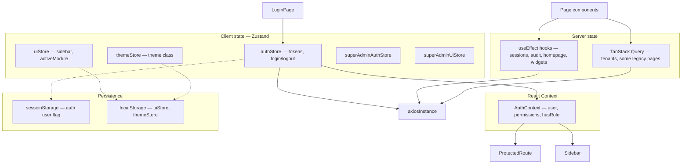

# State Management

The application uses a **layered state model**: Zustand for auth tokens and UI preferences, React Context for the authenticated user and RBAC, TanStack Query for server cache (where adopted), and local component state elsewhere.

> **Redux is not used.** This project has no Redux Toolkit store, slices, reducers, or `react-redux` provider. If you are looking for "Redux setup", use the patterns below instead — or see the [Redux mapping table](#redux-mapping) at the end of this document.

## Overview diagram



---

## 1. Zustand stores

### `authStore` (`src/store/authStore.ts`)

**Purpose:** Authentication actions and short-lived access token.

| State | Persisted? | Notes |
|-------|------------|-------|
| `accessToken` | No | Memory only — cleared on refresh |
| `user` | Yes (sessionStorage) | Basic user from login response |
| `isAuthenticated` | Yes | Flag for quick checks |
| `isLoading`, `error` | No | Transient login UI state |

**Actions:**

- `login(email, password, product)` → `POST /api/auth/login`
- `logout()` → `POST /api/auth/logout`, redirect to `/login`
- `refreshAccessToken()` → `POST /api/auth/refresh` (cookie-based)
- `clearError()`, `setAccessToken()`

Storage key: `KingFisher Tech-auth` in **sessionStorage**. `partialize` excludes `accessToken` from persistence.

> **Type note:** `authStore` defines its own `AuthUser` (role as `string`) which differs from `AuthUser` in `src/types/auth.types.ts` (role object + permissions). `AuthContext` uses the richer type from `/api/auth/me`.

### `uiStore` (`src/store/uiStore.ts`)

**Purpose:** Shell chrome preferences.

| State | Default |
|-------|---------|
| `sidebarCollapsed` | `false` |
| `activeModule` | `'dashboard'` |
| `theme` | `'default'` |

Persisted to **localStorage** (`KingFisher Tech-ui`). `setTheme` toggles `theme-blue` / `theme-red` classes on `<html>`.

### `themeStore` (`src/store/themeStore.ts`)

**Purpose:** Alternate theme system used by `useApplyTheme` in `AppShell`.

| State | Values |
|-------|--------|
| `theme` | `'default' \| 'green' \| 'blue' \| 'red'` |

Persisted to **localStorage** (`KingFisher Tech-theme`). This overlaps with `uiStore.theme` — see [Missing Documentation](./missing-documentation.md).

### Super-admin stores

| Store | File | Purpose |
|-------|------|---------|
| `superAdminAuthStore` | `features/superadmin/store/superAdminAuthStore.ts` | Super-admin JWT and user |
| `superAdminUiStore` | `features/superadmin/store/superAdminUiStore.ts` | Super-admin shell UI state |

These are isolated from the main tenant `authStore` and use `superAdminApiClient`.

---

## 2. React Context — `AuthContext`

**File:** `src/context/AuthContext.tsx`  
**Hook:** `useAuth()` in `src/hooks/useAuth.ts`

`AuthProvider` sits above the router and bridges `authStore` tokens to enriched user data:

```
accessToken present?
  yes → GET /api/auth/me → set user (permissions, role, tenantId)
  no  → user = null
```

**Exposed API:**

| Method / field | Behavior |
|----------------|----------|
| `user` | Full `AuthUser` from `/api/auth/me` |
| `isAuthenticated` | `!!user` (or always true in dev bypass) |
| `isLoading` | True while `/api/auth/me` is in flight |
| `hasPermission(...keys)` | Every key must be in `user.permissions` |
| `hasAnyPermission(...keys)` | At least one key matches |
| `hasRole(slug)` | `user.role.slug === slug` |
| `logout()` | Calls store logout + clears context user |

### Dev bypass

When `import.meta.env.DEV && VITE_BYPASS_AUTH === 'true'`:

- Skips `/api/auth/me`
- Injects `MOCK_USER` with admin role
- All permission checks return `true`

---

## 3. TanStack Query

**Config:** `src/lib/queryClient.ts` — 5 min stale time, 1 retry, no refetch on focus.

**Adopted in:**

- `features/tenants/hooks/*` — full query key factory pattern (`tenantKeys`)
- Legacy pages: `CustomerList`, `InvoiceList`, `QuotationList`, `JobList`, `EmployeeList`, etc.

**Tenant query pattern (recommended):**

```typescript
export const tenantKeys = {
  all: ['superadmin', 'tenants'] as const,
  list: (params) => [...tenantKeys.all, 'list', params] as const,
  detail: (id) => [...tenantKeys.all, 'detail', id] as const,
};

export function useTenants(params) {
  return useQuery({
    queryKey: tenantKeys.list(params),
    queryFn: () => tenantService.list(params),
    placeholderData: keepPreviousData,
  });
}
```

Mutations in `useTenantMutations` invalidate related query keys after create/update/delete.

---

## 4. Local state (useState + useEffect)

Several hooks fetch data without TanStack Query:

| Hook | Endpoint | Pattern |
|------|----------|---------|
| `useHomepageConfig` | `/api/users/:id/homepage-config` | Fetch on mount; optimistic PATCH |
| `useSessions` | `/api/auth/sessions` | Manual refresh via `tick` state |
| `useLoginSecurity` | `/api/users/:id/login-security` | Fetch + PATCH with saving flag |
| `useAuditLogs` | `/api/audit-logs` | Paginated fetch with filters |
| Dashboard widgets | Various `/api/jobs/summary/*` | Per-widget `useEffect` |

**Trade-off:** No shared cache or automatic invalidation; simpler for one-off screens but inconsistent with the tenant module pattern.

---

## 5. Data flow by user action

### Login

```
LoginPage (react-hook-form)
  → useAuthStore.login()
  → POST /api/auth/login
  → set accessToken + user in store
  → navigate to /dashboard
  → AuthContext effect sees accessToken
  → GET /api/auth/me
  → set enriched user with permissions
  → Sidebar filters NAV_ITEMS
```

### Authenticated API call

```
Component / hook
  → axiosInstance.get/post(...)
  → request interceptor adds Bearer token
  → on 401: refreshAccessToken() → retry original request
  → on refresh failure: logout() → /login
```

### Logout

```
LogoutButton / authStore.logout()
  → POST /api/auth/logout
  → clear store (token + user)
  → window.location.href = '/login'
  → AuthContext sets user = null
```

### Permission-gated route

```
ProtectedRoute
  → useAuth() → isLoading? → AppShellSkeleton
  → !isAuthenticated? → Navigate /login
  → requirePermissions / requireRole fail? → Navigate /403
  → <Outlet />
```

---

## 6. Where to put new state

| Use case | Recommended approach |
|----------|---------------------|
| Auth tokens, login | `authStore` |
| Current user + RBAC checks | `AuthContext` / `useAuth()` |
| Server lists with cache/invalidation | TanStack Query + service module |
| Sidebar, theme, layout prefs | Consolidate into one theme store (see gaps doc) |
| Form wizard step | Local `useState` in page |
| Super-admin session | `superAdminAuthStore` |

---

## 7. Known inconsistencies

1. **Dual user models** — `authStore.user` vs `AuthContext.user` (different shapes).
2. **Dual theme stores** — `uiStore` and `themeStore` both manage theme.
3. **Sidebar reads both** — `AuthContext` for permissions, `authStore` for display name fallback.
4. **Mixed data fetching** — TanStack Query in some modules, raw hooks in others.

See [Missing Documentation](./missing-documentation.md) for remediation suggestions.

---

## 8. Redux mapping

This codebase does **not** include Redux. Use this table when migrating from or comparing to Redux patterns:

| Redux concept | This project |
|---------------|--------------|
| Redux store | Not used |
| Slice / reducer | Zustand store (`authStore`, `uiStore`) or Query cache |
| Actions / thunks | Zustand methods; `queryFn` / `mutationFn` in TanStack Query |
| `useSelector` | `useAuthStore((s) => s.field)`; `useQuery` return value |
| `dispatch` | Direct store method calls; `mutate()` / `mutateAsync()` |
| RTK Query | TanStack Query (`@tanstack/react-query`) |
| Normalized entities | Per-query cache keys (not globally normalized) |

**Global providers in `main.tsx`:**

```tsx
<QueryClientProvider client={queryClient}>  {/* TanStack Query */}
  <AuthProvider>                             {/* React Context */}
    <AuthLoadingGate>
      <RouterProvider router={router} />
    </AuthLoadingGate>
  </AuthProvider>
</QueryClientProvider>
```

No `<Provider store={...}>` from react-redux exists.
