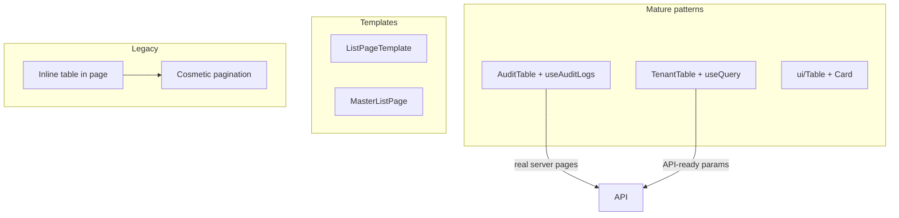

# Tables and Pagination

How data tables and pagination are implemented across the codebase. **There is no shared pagination component** in `components/ui/` — implementations vary by module maturity.

---

## Implementation landscape

| Pattern | Where used | Pagination |
|---------|------------|------------|
| **UI `Table` primitives** | `CustomerList`, `DashboardPage`, `MasterListPage` | Static / decorative |
| **Dedicated table component** | `TenantTable`, `AuditTable` | Varies |
| **`ListPageTemplate`** | Available, lightly adopted | None built-in |
| **Inline `<table>` in page** | `EmployeesListPage`, `UserAccessPage`, legacy lists | Rows-per-page select + count label |
| **TanStack Query list** | `TenantListPage`, `useTenants` | Server params `page`, `limit` (service-ready) |

---

## Table implementations

### 1. Composable UI Table (design system)

**File:** `src/components/ui/Table/Table.tsx`

```tsx
import {
  Table, TableHeader, TableBody,
  TableRow, TableHead, TableCell,
} from '@/components/ui/Table';

<Card padding="none">
  <Table>
    <TableHeader>
      <TableRow>
        <TableHead>Name</TableHead>
      </TableRow>
    </TableHeader>
    <TableBody>
      {rows.map((row) => (
        <TableRow key={row.id}>
          <TableCell mono>{row.code}</TableCell>
          <TableCell>{row.name}</TableCell>
        </TableRow>
      ))}
    </TableBody>
  </Table>
</Card>
```

| Feature | Support |
|---------|---------|
| Styling | CSS variables (`--color-neutral-*`) |
| Monospace cells | `mono` prop on `TableCell` |
| Row hover | Built into `TableRow` |
| Row selection highlight | `selected` prop on `TableRow` |
| Sorting | Not built-in |
| Pagination | Not built-in |
| Empty state | Manual — extra row or conditional render |

**Example:** `src/pages/customers/CustomerList.tsx`

---

### 2. Dedicated module table (Tenant pattern)

**File:** `src/features/tenants/components/TenantTable/TenantTable.tsx`

- Raw `<table>` with Tailwind (`rounded-2xl`, slate colors)
- Props: `tenants`, `isLoading`, action callbacks
- Loading row: `colSpan={7}` “Loading…”
- Empty row: “No tenants found”
- Row click navigates to detail
- Actions via `TenantActionMenu` (kebab dropdown)

Parent page owns data fetching and mutations; table is presentational.

---

### 3. ListPageTemplate

**File:** `src/components/templates/ListPageTemplate.tsx`

Generic list page with:

- Header + optional `primaryAction` button
- Status tab pills
- Search input
- `filters` slot (ReactNode)
- Configurable `columns` with optional `render(row)` 
- Built-in loading and empty rows

```typescript
interface ListColumn<T> {
  key: string;
  label: string;
  render?: (row: T) => ReactNode;
  className?: string;
}
```

No pagination — comment in file suggests swapping table block or extending template.

---

### 4. MasterListPage scaffold

**File:** `src/components/layout/MasterListPage.tsx`

Opinionated master-data layout:

- Page header + “+ Add New” `Button`
- Search input + Filter + Export buttons (non-functional stubs)
- `Table` primitives inside `Card`
- Hardcoded “Active” badge and Edit/Delete links
- Decorative pagination footer

Useful as a **layout reference**, not production-ready CRUD.

---

### 5. Legacy inline tables

**Examples:** `EmployeesListPage`, `UserAccessPage`, `AllShipmentsPage`, `ClientRequestListPage`

Structure repeated across files:

```
┌─ white card (border gray-200) ─────────────────┐
│ Header: title + Back + Create buttons          │
│ Filter grid (label right-aligned)              │
│ Toolbar: search, rows-per-page select          │
│ <table className="w-full text-sm">             │
│ Top pagination bar                             │
│ ... rows ...                                   │
│ Bottom pagination bar                          │
└────────────────────────────────────────────────┘
```

- Column headers as `const columns = [...]` array (sometimes unused for rendering)
- Icon action buttons (Pencil, Heart) in last column
- `ChevronLeft` Back → `navigate(-1)`

---

### 6. AuditTable (full server pagination)

**File:** `src/components/audit/AuditTable.tsx`

The **most complete pagination implementation** in the codebase.

**Data shape** (`AuditLogPage`):

```typescript
{
  data: AuditLogEntry[];
  page: number;
  pageSize: number;
  total: number;
  totalPages: number;
}
```

**Hook** (`useAuditLogs`):

- Sends `page` and `pageSize=50` as query params
- `setPage` triggers refetch
- Filters reset page to 1

**Pagination UI** (private component in same file):

- “Showing {from}–{to} of {total} entries”
- Previous / numbered pages (max 7 visible, windowed around current) / Next
- Disabled states on first/last page
- `onPage(p)` callback to parent

```tsx
<AuditTable data={auditData} onPage={setPage} />
```

**Use this as the reference** when implementing real server-side pagination.

---

## Pagination patterns

### A. Server-side (production-ready)

| Piece | Implementation |
|-------|----------------|
| API params | `page`, `limit` / `pageSize` |
| Hook state | `const [page, setPage] = useState(1)` |
| Query key | Include `page` in key: `['audit', page, filters]` |
| UI | `AuditTable` pagination or extract to shared component |
| Total count | From API response `total`, `totalPages` |

Tenant service supports `page`/`limit` in `TenantListParams` but list UI does not yet wire page controls.

### B. Rows-per-page select (legacy cosmetic)

```tsx
const [rows, setRows] = useState('10');

<select value={rows} onChange={(e) => setRows(e.target.value)}>
  <option>10</option>
  <option>25</option>
</select>
```

Often **does not slice data** — display-only. See `EmployeesListPage`, `UserAccessPage`.

### C. Count label only

```tsx
function Pagination({ count }: { count: number }) {
  return (
    <div className="px-5 py-2 text-sm text-gray-500">
      {count > 0 ? `1 - ${count}` : ''}
    </div>
  );
}
```

Shows range `1 - N` where N = full array length (not real pages).

### D. Decorative prev/next (prototype)

`CustomerList`, `MasterListPage`:

```tsx
<div className="flex gap-1">
  <button>←</button>
  <button className="bg-primary text-white">1</button>
  <button>→</button>
</div>
```

Buttons are not wired to state changes.

### E. Client-side filter only

`CustomerList` filters mock data in memory, then shows “Showing {filtered.length} of {customers.length}” — pagination buttons inactive.

---

## Loading and empty states

| Pattern | Loading | Empty |
|---------|---------|-------|
| `TenantTable` | Single row “Loading…” | “No tenants found” |
| `ListPageTemplate` | `isLoading` → loading row | `emptyLabel` prop |
| `AuditTable` | Handled by parent page | “No audit logs found…” |
| `ui/Table` pages | Often no loading state | Manual `colSpan` row |
| Legacy pages | `loading` state, sometimes blank table | Zero rows |

---

## Comparison diagram



---

## Recommendations for new modules

1. **Table markup:** Use `components/ui/Table` for main app, or dedicated `<Entity>Table` component for complex row actions.
2. **List page:** Start from `ListPageTemplate` or Tenant list structure.
3. **Pagination:** Copy `AuditTable` pagination pattern; wire `page`/`pageSize` to TanStack Query key and API params.
4. **Avoid:** Copying legacy `Pagination({ count })` or decorative arrow buttons without wiring.
5. **Query:** Use `placeholderData: keepPreviousData` when changing pages/filters to prevent flicker.

### Minimal server pagination hook sketch

```typescript
export function useEntityList(params: { page: number; limit: number; search?: string }) {
  return useQuery({
    queryKey: entityKeys.list(params),
    queryFn: () => entityService.list(params),
    placeholderData: keepPreviousData,
  });
}
```

---

## Related docs

- [Reusable components](./reusable-components.md) — Table primitive API
- [API service layer](./api-service-layer.md) — list endpoint params
- [Module template](./module-template.md) — list page blueprint
- [Project patterns](./project-patterns.md) — table conventions
